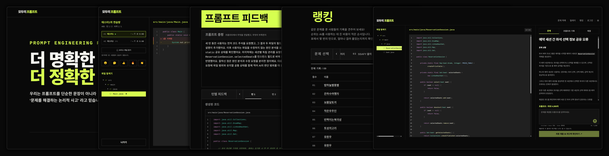
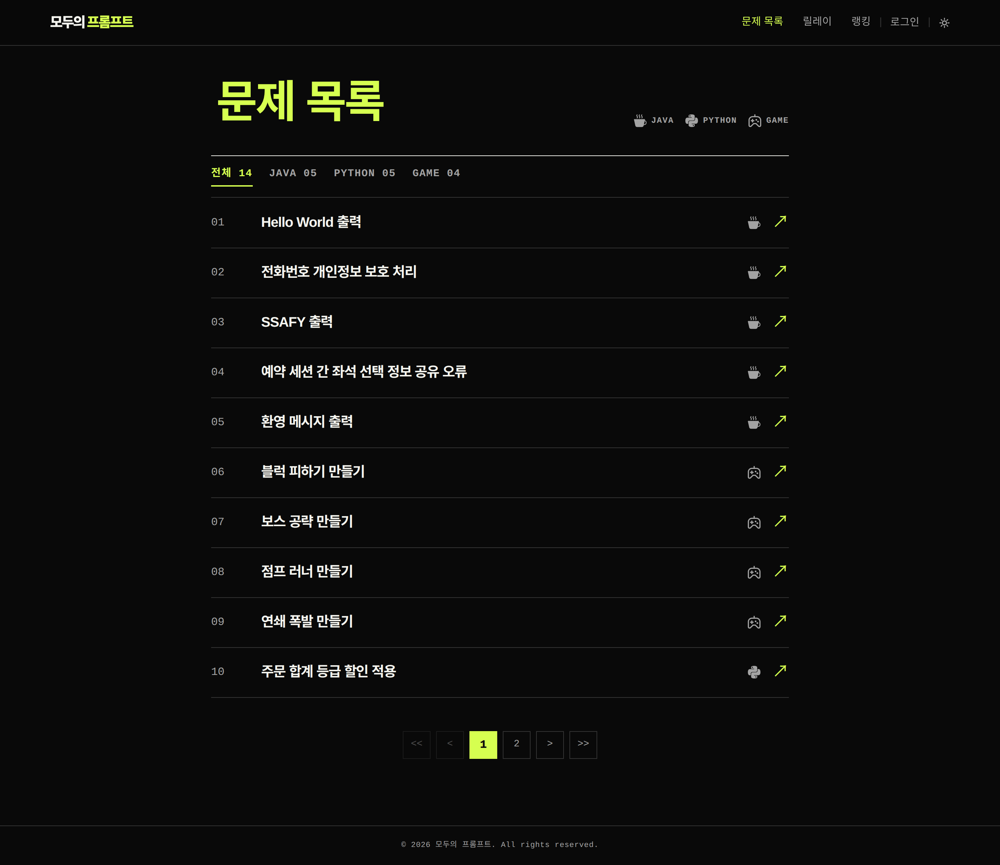
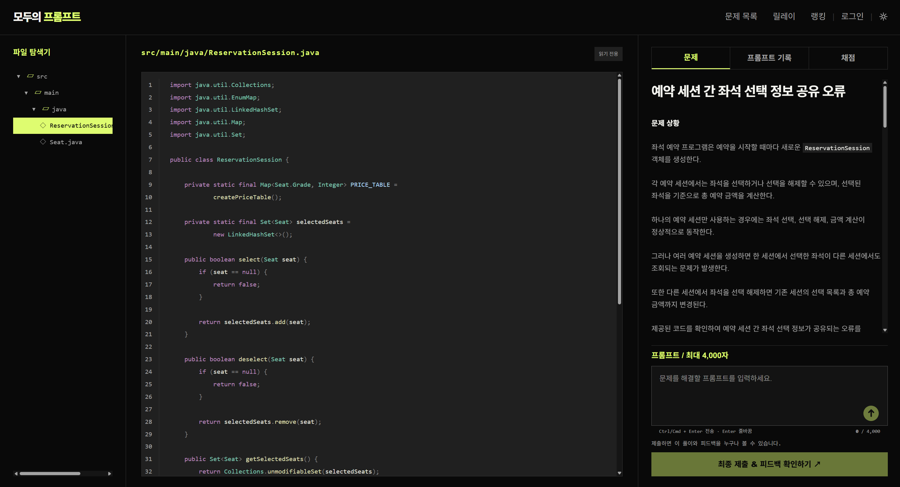
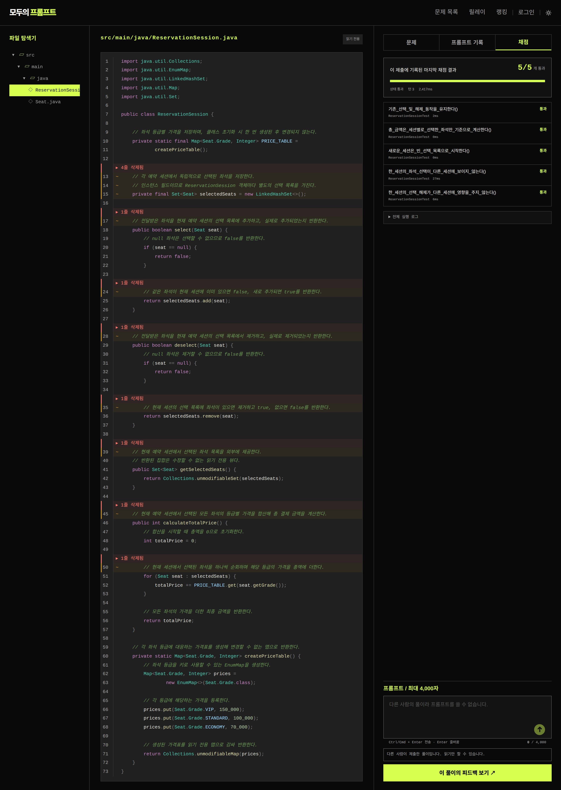
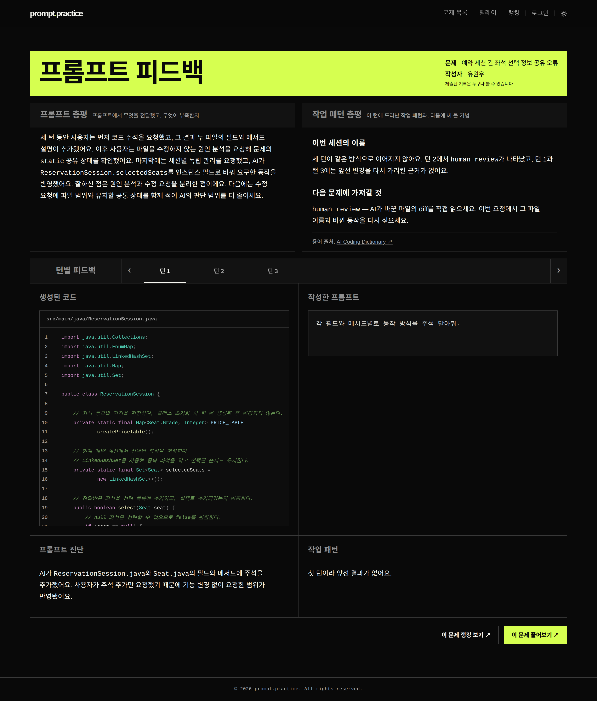
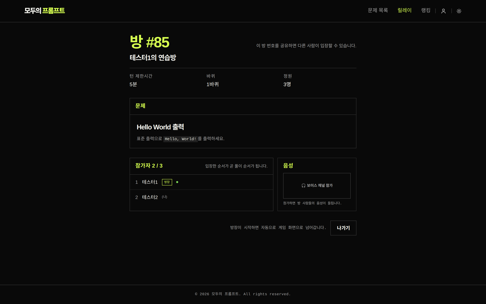
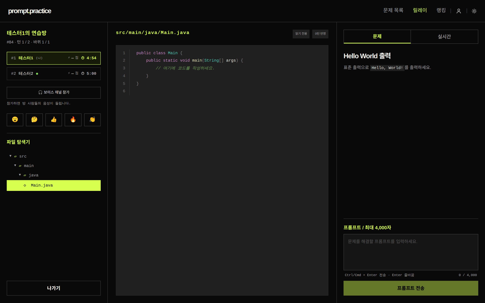
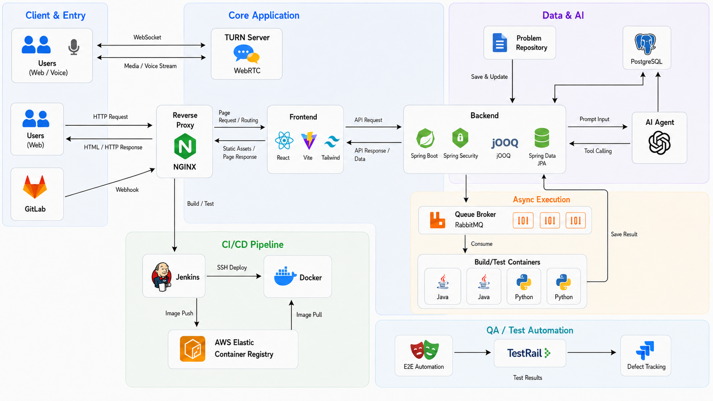
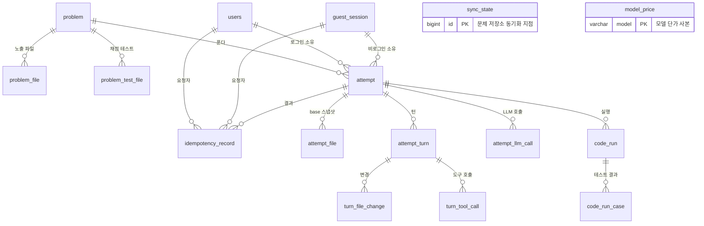

# 모두의 프롬프트
#### 주니어 개발자를 위한 피드백 기반 프롬프트 실력 향상 서비스

 **https://lets.promptpractice.run/**

## :four_leaf_clover: 팀원 구성

| 유원우 | 박찬영 | 조유진 | 장수철 | 최동욱 | 김상현 |
|---|---|---|---|---|---|
| AI | BE | FE | PM | QA | Infra |

## :calendar: 개발 기간
- **2026.07.06 - 08.10**
- 최종 발표일 : **08.10**

 **:framed_picture: 발표 자료 :** [최종발표(HTML)](https://drive.google.com/file/d/193r1RxneerWoU7t-wMtBYYljMnGmd2mJ/view?usp=sharing)

 

## :orange_book: 프로젝트 개요
### 왜 만들게 되었나요?

AI가 코드를 대신 써주면서 개발자가 덜 하게 된 일이 둘 있습니다. 
- **무엇이 문제인지 규정하는 일**
- **돌아온 결과가 원하던 것인지 따지는 일**

대충 물어봐도 그럴듯한 코드가 나오는 환경에서는 이 둘을 연습할 계기가 생기지 않습니다. 결과가 어차피 그럴듯하게 나오니, 따질 이유도 없었습니다.

**「모두의 프롬프트」**는 **그 둘을 연습할 수 있는 플랫폼**입니다. 대충 물어보면 원하는 코드가 나오지 않는 조건을 걸어두고, 그 안에서 문제를 풀게 합니다.

### 어떻게 다른가요?

같은 문제를 ChatGPT 창에서도 풀 수 있습니다. 문제 설명을 통째로 붙여넣으면 되니까요. 그러면 요구사항을 문장으로 만드는 일은 출제자가 이미 해둔 것이고, 사용자는 옮기기만 합니다.

- **서버가 모델에게 문제 설명을 넘기지 않는다.** 
    LLM이 받는 것은 사용자가 쓴 프롬프트와 현재 코드뿐입니다. 문제가 무엇을 요구하는지 아는 쪽은 사용자뿐이고, 그것을 말로 옮기지 못하면 원하는 코드는 나오지 않습니다. 프롬프트가 곧 명세입니다.

- **모호한 프롬프트는 결과 생성 전에 막힌다.** 무엇을 원하는지 읽어낼 수 없는 프롬프트는 거절되어 코드 생성까지 가지 않습니다. "이거 고쳐줘"로는 아무 일도 일어나지 않습니다. 짧은 LLM 호출로 판정합니다.

### 무엇이 돌아오나

프롬프트를 한 번 보내는 것이 **턴** 하나입니다. 턴이 쌓이면서 코드가 자랍니다. 돌아오는 것은 셋인데, 시점이 각각 다릅니다.

- **코드** — 턴마다. 모델이 파일을 어떻게 고쳤는지, 직전 턴과의 차이를 줄 단위로 볼 수 있습니다.
- **채점** — 원할 때. 생성된 코드를 실제로 **빌드**하고 **테스트**를 돌립니다. 통과 여부가 사람 판단이 아니라 테스트로 결정됩니다.
- **피드백** — **최종 제출할 때 한 번**. 그 세션의 프롬프트 전체를 되짚어, 무엇을 전달했고 무엇이 빠졌는지 알려줍니다.

혼자 푸는 것 말고 여러 명이 한 문제를 번갈아 이어 푸는 **릴레이 모드**도 있습니다 ([아래](#릴레이-모드)).

## :mag_right: 핵심 개념

**:book: 문제** :  별도의 GitLab 저장소에서 옵니다. 문제 하나는 사용자에게 보여줄 파일들과 채점에 쓸 테스트 파일들로 이뤄집니다. 테스트 파일 내 메서드가 체크리스트가 됩니다.

**:pencil2: 풀이** : 문제를 열면 **풀이**가 하나 시작됩니다. 한 문제를 붙잡고 있는 세션 하나이고, 그 안에 **워크스페이스**(지금까지 프롬프트로 수정하고, 빌드업을 수행한)가 담깁니다. 혼자 풀면 한 사람이 그 풀이를 소유하고, 릴레이 모드에서는 방 하나가 풀이 하나를 공유합니다.

**:page_facing_up: 턴** :  프롬프트 **한 번**입니다. 프롬프트를 보내면 모델이 워크스페이스의 파일을 읽고 고쳐서 돌려주고, 그 결과가 다음 턴의 출발점이 됩니다. 턴이 진행되며 코드가 고도화됩니다. 프롬프트가 거절된다면, 하나의 턴으로 성립하지 않습니다.

**:pencil: 채점** : 워크스페이스의 코드를 별도 컨테이너의 워커가 **컴파일하고 테스트**를 돌립니다.

**:keyboard: 제출** : 제출하면 해당 풀이의 입력했던 프롬프트 전체를 되짚어 본 피드백이 요청됩니다.

| 렌즈 \ 단위 | 턴마다 하나씩 | 세션 전체에 하나 |
|---|---|---|
| **프롬프트 피드백** | 이 턴 프롬프트가 무엇을 전달했고 무엇이 빠졌는지 | 세션 내내 반복된 습관과 그 이유 |
| **작업 패턴** | 이 턴에 일한 방식에 붙인 이름과 근거 | 이번 세션의 이름, 그리고 **다음 문제에 가져갈 것** |

- 두 렌즈는 보는 자리가 다릅니다. 
    - 프롬프트 피드백 : **한 턴 안**을 봅니다. 그 프롬프트가 전달한 것이 그 턴의 코드 변경에 남았는가. 
    - 작업 패턴 : **턴과 턴 사이**를 봅니다 — 앞 턴이 낸 결과를 이번 턴이 어떻게 이어받았는가. 하나는 판정하고, 하나는 이름을 붙입니다.

**:white_check_mark: 프롬프트 평가 기준**

| 기준 | 담아야 할 것 |
|---|---|
| 목표 | 무엇을 해달라는 것이고, 그 결과 무엇이 달라지는가 |
| 작업 대상 | 어느 파일·클래스·메서드이고, 지금 무슨 일이 일어나고 있는가 |
| 요구사항 | 충족해야 할 동작. 항목마다 참·거짓을 가릴 수 있는 한 문장 |
| 제약 | 유지해야 할 동작, 건드리면 안 되는 범위 |
| 완료 조건 | 무엇이 참이면 끝인가, 그것을 어떻게 확인하는가 |
| 검증 | 고친 뒤 다시 확인하고, 확인하지 못했으면 그렇다고 밝힐 것 |

- 두 번째 턴부터는 여기에 **직전 결과**에 대해 평가가 추가됩니다.
    - 앞 턴 결과에서 무엇이 맞았고, 무엇이 어긋났는지 

**:trophy: 랭킹** :  문제마다 있고, 기준은 정확도가 아니라 **비용**입니다. 
- 같은 문제를 누가 더 적은 토큰으로 풀어냈는지 봅니다.

- 마지막 턴의 코드가 **테스트를 전부 통과**해야 랭킹에 수록될 수 있습니다. 일부만 통과한 제출은 오르지 않습니다.

- 비용에는 **턴에 속한 LLM 호출만** 셉니다. 피드백 생성을 위한 비용은 포함되지 않습니다.

 

## 문제 풀이 - 사용자 흐름

#### **1. 문제 선택**

- **Java·Python** 문제
- **게임** 문제
- 풀이하고 싶은 문제를 선택하여 시작합니다.

#### **2. 프롬프트 작성**

- 문제를 열면 왼쪽에 코드, 오른쪽에 프롬프트 창이 놓입니다(맨 위 화면).
    - 코드는 읽을 수만 있고 **직접 고칠 수 없습니다**.
    - 코드의 추가, 수정, 삭제는 **프롬프트 입력**을 통해서만 가능합니다.

- 프롬프트를 보내면 오른쪽 **프롬프트 기록**에 턴이 하나씩 쌓입니다. 
    - 턴마다 무엇을 요청했고 모델이 무엇을 했는지, 어느 파일을 건드렸는지, 토큰을 얼마나 썼는지가 함께 남습니다. 
- 코드 쪽에는 직전 턴과의 차이가 줄 단위로 표시됩니다(**diff 표시**).

#### **3. 채점(빌드 및 테스트)**

- `채점` 탭을 누르면 그 시점의 코드가 워커로 넘어가 실제로 컴파일되고 테스트를 수행합니다.
    - 빌드/테스트는 **별도의 외부 컨테이너**에서 수행됩니다.
    - 테스트 항목이 표시되고, 각각의 통과 여부를 확인할 수 있습니다.
    - 몇 번이든 다시 요청할 수 있습니다.

#### **4. 제출 - 피드백 요청**

- 제출하면 그 **세션 전체에서의 프롬프트 입력**에 대해 **피드백**이 제공됩니다.
    - 상단 두 상자가 **총평**이고, 왼쪽은 프롬프트에서 무엇이 부족했는지, 오른쪽은 이번 세션의 작업 패턴에 붙인 이름과 다음 문제에 가져갈 것 입니다. 
    - 아래에는 **턴별 피드백**이 턴 수만큼 제공됩니다.

- **제출된 기록은 누구나 볼 수 있습니다.** 
    - 타 유저가 같은 문제를 어떤 프롬프트로 풀었는지 확인할 수 있습니다.

## 릴레이 모드

- **여러 명**이 한 문제를 **정해진 순서대로 이어 푸는** 모드입니다. 
    - 방장이 방을 열어 인원·바퀴 수·턴 제한시간을 정하고, 참가자가 모이면 시작합니다. 
    - 게임 중에는 참가자들과 서로 **음성**으로 소통할 수 있습니다(보이스 채팅).
    - 참가자가 입력하는 프롬프트를 **실시간 타이핑**으로 확인할 수 있습니다.

- **방 하나 =  어템프트(Attempt) 하나**와 대응됩니다. 
    - 코드가 개선되는 과정은 혼자 풀 때와 똑같이 풀이와 턴이 담당하고, 방은 순서와 진행 단계만 들고 있습니다. 
    - 채점·코드 diff·피드백도 동일하게 수행됩니다.

- **WebSocket 활용**
    - 게임 상태와 WebRTC 시그널링은 WebSocket 하나로 흐르고, 음성은 coturn 서버가 중계를 담당합니다.

## :wrench: 시스템 아키텍처

| 이름 | 무엇인가 |
|---|---|
| `Frontend` | React 화면. 개발에서는 Vite 서버가 `/api`·`/ws`를 백엔드로 넘깁니다. |
| `Backend` | Spring Boot 애플리케이션. 프롬프트 게이트, LLM 호출, 워크스페이스 저장, 채점 요청·결과 수집, 피드백 생성, 릴레이 게임의 서버 권위 채널을 모두 맡습니다. |
| `DB` | PostgreSQL DB를 사용합니다. 문제·풀이·턴·LLM 호출 기록·채점 결과·릴레이 방 테이블 등이 존재합니다.|
| `Queue Broker` | RabbitMQ. 채점 요청과 결과가 오가는 큐 브로커입니다. 언어별로 큐를 별도로 가지고(`run.request.java`, `run.request.python`), 큐는 소비자(worker)에게 요청을 분배합니다. |
| `Build/Test Containers` | 사용자 코드를 실제로 컴파일하고 테스트를 돌리는 워커(컨테이너)입니다. Java 2대, Python 2대가 각자 자기 큐의 경쟁 소비자로 붙게 됩니다. |
| `Problem Repository` | 문제가 저장된 별도 GitLab 저장소 |
| `AI Agent` | OpenAI. 코드 생성, 프롬프트 게이트 판정, 피드백 생성을 수행하는 에이전트입니다. |
| `TURN Server` | coturn. 릴레이 모드의 음성이 P2P로 직결되지 못할 때 미디어를 중계하는 역할을 합니다. |

### 프롬프트 한 번의 흐름

1. 사용자가 프롬프트를 보낸다.
2. **게이트가 먼저 본다.** 
    - 무엇을 원하는지 읽어낼 수 없으면 여기서 거절되고 코드 생성 호출로 넘어가지 않는다. 게이트 판정도 LLM이 하지만, 짧은 판정 호출 하나로 끝난다.
3. 백엔드가 LLM을 호출한다. 
    - 이때 넘기는 것은 사용자 프롬프트와 현재 코드뿐이고, **문제 설명은 넘기지 않는다.**
4. 모델이 도구를 호출해 워크스페이스를 만진다.
    - `list_files`로 파일 목록을 보고, `read_file`로 내용을 읽고, `edit_file`로 고친다. 
    - 새 파일은 만들 수 없다.
5. 바뀐 파일과 호출 기록, 토큰 사용량이 DB에 저장된다. 
    - 여기까지가 **턴 하나**
6. 사용자가 채점을 누르면 백엔드가 `Queue Broker`에 실행 요청을 넣는다.
7. 워커가 그것을 집어 자기 컨테이너에서 컴파일하고 테스트를 돌린 뒤, 결과를 결과 큐로 돌려보낸다.
8. 백엔드가 그 결과를 받아 DB에 쓴다.

### 문제 동기화
 - 백엔드가 **부팅 직후** 한 번
 - 그 이후 **5분 간격**으로 문제 저장소를 읽어(**Scheduler**) DB를 갱신합니다.

### 비동기 처리를 위한 큐(RabbitMQ)
  - 채점(빌드/테스트) 요청을 발행(Produce)
  - **문제 언어별(Java, Python) Queue**에 적재
  - 채점 컨테이너
    - **Java 2개, Python 2개**
    - 각 컨테이너는 해당하는 Queue의 요청을 **경쟁적으로 소비(Consume)**
  - 채점 결과(빌드 성공여부, 테스트 케이스 수행 결과)가 결과 Queue에 다시 발행
    - DB에 저장

 

## 기술 스택

| 구분 | 스택 |
|---|---|
| **Backend** |         |
| **Frontend** |      |
| **Database** |  |
| **Infra** |        |
| **Build/Test Container** |     |
| **QA / Test Automation** |    |
| **AI Model** |  |

 

## 데이터 모델과 문서

테이블 **19개**, 외래키 **22개**입니다. 
- 핵심 도메인 축 : `problem` → `attempt` → `attempt_turn`. 
    - 외래키가 없는 테이블 : 문제 저장소의 커밋 지점과 모델 단가표

- `backend/src/main/resources/schema.sql` 로 스키마 초기 세팅
- `ddl-auto: none` : 엔티티 애노테이션이 테이블을 만들지 않습니다.

전체 관계도와 영역별 설명은 **[ERD 문서](docs/erd.md)**에 있습니다.

 

## 설계 판단 요소

구현에서 갈림길이 있었던 결정 넷입니다. 근거와 관련 코드는 **[설계 판단 요소 문서](docs/design-decisions.md)**에 있습니다.

| 결정 | 왜 |
|---|---|
| **워커에 DB 자격증명을 주지 않는다** | 사용자 코드가 워커와 같은 uid로 돌아 환경변수를 비워도 새어나감. 막는 대신 아예 주지 않음 |
| **모르는 값을 0으로 적지 않는다** | 단가표에 없는 모델은 비용을 비워두고, 그런 호출이 하나라도 있으면 랭킹에서 빠짐 |
| **재시도가 중복 과금이 되지 않게** | 풀이 생성·턴 추가에 `Idempotency-Key`. 실패한 키는 지우고, 7분 넘긴 선점은 인수 |
| **피드백은 전부 있거나 전부 없다** | 네 칸 중 하나라도 실패하면 제출 전체를 실패시킴. 절반만 있는 화면은 이유를 설명할 수 없음 |

 

## 문서 목록

| 문서 | 무엇이 있나 |
|---|---|
| [설계 판단 요소](docs/design-decisions.md) | 갈림길이 있었던 결정 넷과 그 근거, 관련 코드 위치 |
| [API 레퍼런스](docs/api.md) | 전체 엔드포인트, 인증·소유권 규칙, 에러 코드표, 멱등키 규칙 |
| [ERD](docs/erd.md) | 테이블 관계도와 영역별 설명, 스키마 설계 판단 |
| [인증 API](docs/auth-api.md) | 가입·로그인·세션 계약 |
| [제출 피드백 개요](backend/docs/feedback-overview.md) | 제출 한 번이 만드는 네 칸이 어떻게 구성되고 어디에 앉는가 |
| [프롬프트 결과 형식](backend/docs/prompt-format.md) | 피드백이 프롬프트를 대조하는 여섯 칸의 정의 |
| [LLM 제약 설계](docs/attempt-llm-constraints.md) | 모델에게 무엇을 주지 않을지 정한 과정과 그 뒤의 경과 |
| [툴 콜링 설계](backend/docs/tool-calling-design.md) | 모델에게 준 도구 셋과 그 경계 |
| [릴레이 게임 기획](docs/relay-game-plan.md) | 방·순서·진행 단계 판단 |
| [관측 계획](docs/observability-plan.md) | 로그 구조와 조회 방법 |

설계 문서 일부는 **결정된 것이 아니라 조사와 제안**임. 
- 각 문서 머리에 작성일과 상태를 먼저 확인. 
- ex) `docs/carry-line.md`는 "제출 뒤 다음 문제로 가져갈 규칙 한 줄을 만들어 주자"는 제안의 조사 기록이고, 아직 구현되지 않았음. 

