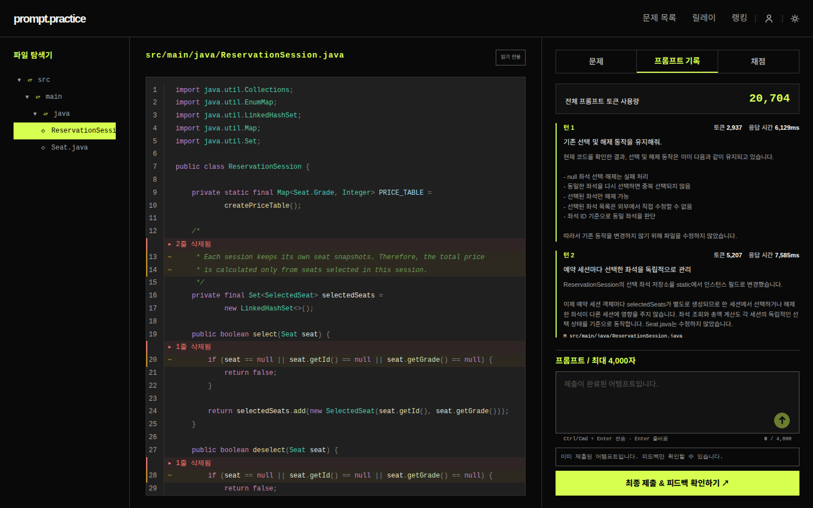
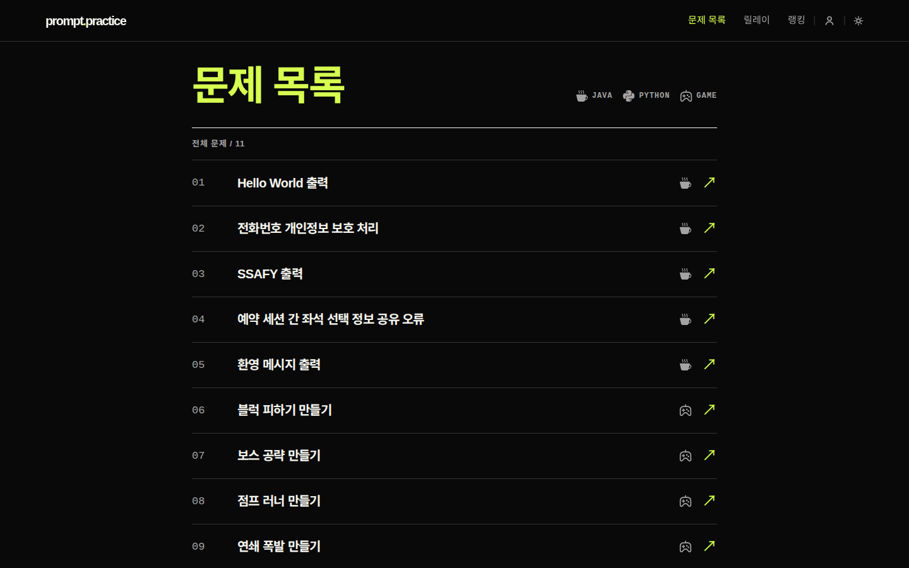
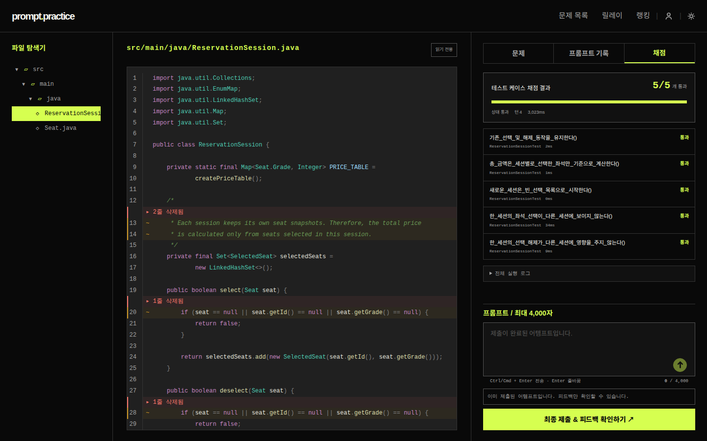
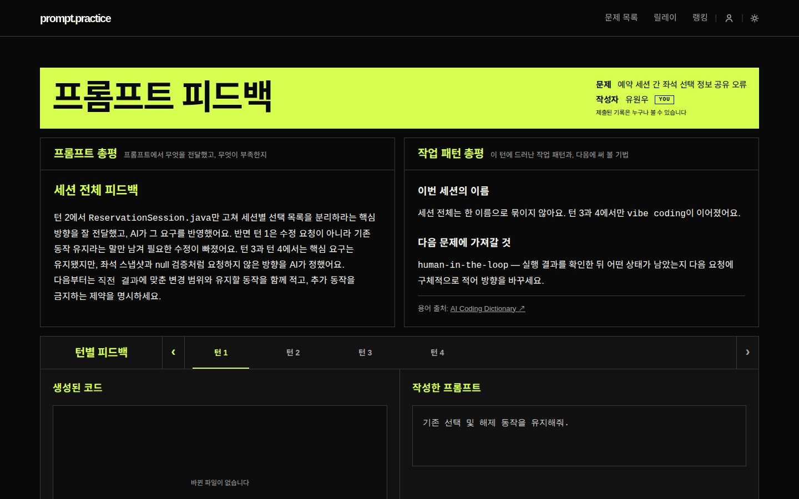
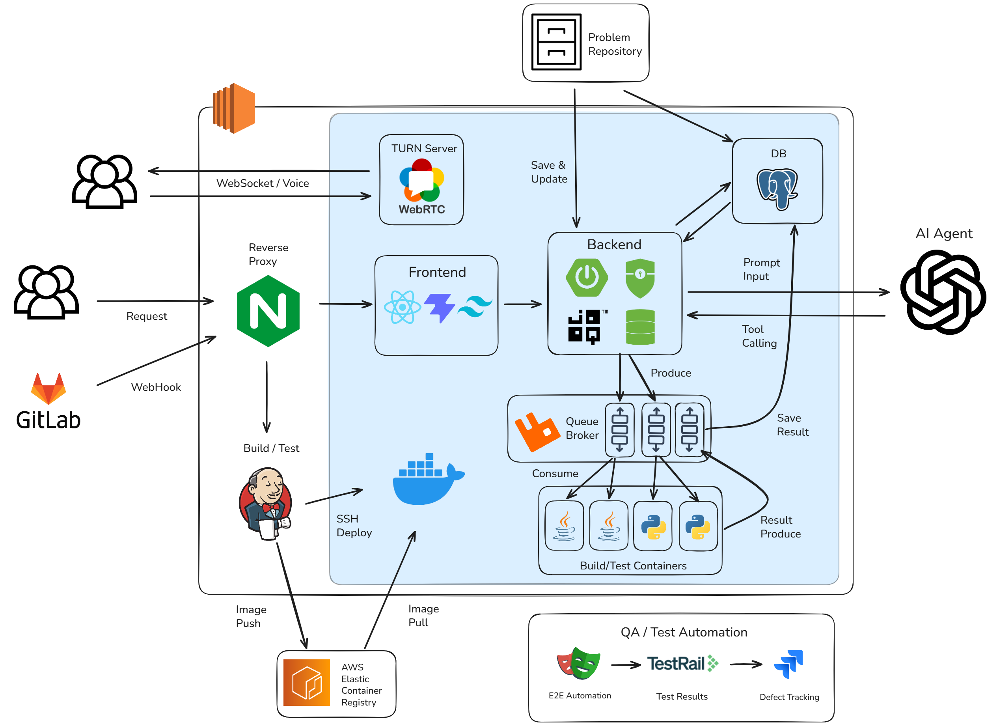

# prompt.practice

주니어 개발자가 **문제를 정의하는 능력**을 기르는 코딩 연습 서비스입니다. 코드를 직접 쓰지 않고, LLM에게 보낼 프롬프트만 써서 문제를 풉니다.

배포: **https://lets.promptpractice.run/**

## 왜 만들었나

AI가 코드를 대신 써주면서 개발자가 덜 하게 된 일이 둘 있습니다. **무엇이 문제인지 규정하는 일**과 **돌아온 결과가 원하던 것인지 따지는 일**입니다. 대충 물어봐도 그럴듯한 코드가 나오는 환경에서는 이 둘을 연습할 계기가 생기지 않습니다. 결과가 어차피 그럴듯하니 따질 이유도 없습니다.

prompt.practice는 그 계기를 인위적으로 만듭니다. 대충 물어보면 원하는 코드가 나오지 않는 조건을 걸어두고, 그 안에서 문제를 풀게 합니다.

## 어떻게 다른가

같은 문제를 ChatGPT 창에서도 풀 수 있습니다. 문제 설명을 통째로 붙여넣으면 되니까요. 그러면 요구사항을 문장으로 만드는 일은 출제자가 이미 해둔 것이고, 사용자는 옮기기만 합니다.

**여기서는 서버가 모델에게 문제 설명을 넘기지 않습니다.** LLM이 받는 것은 사용자가 쓴 프롬프트와 현재 코드뿐입니다. 문제가 무엇을 요구하는지 아는 쪽은 사용자뿐이고, 그것을 말로 옮기지 못하면 원하는 코드는 나오지 않습니다. 프롬프트가 곧 명세입니다.

사용자가 문제 설명을 직접 복사해 붙여넣는 것까지 막지는 않습니다. 막을 방법도 없고, 막을 이유도 없습니다 — 무엇을 넣고 무엇을 뺄지 고르는 일이 남아 있고, 그게 연습시키려는 바로 그 일이기 때문입니다.

**모호한 프롬프트는 코드 생성 전에 막힙니다.** 무엇을 원하는지 읽어낼 수 없는 프롬프트는 거절되어 코드 생성까지 가지 않습니다. "이거 고쳐줘"로는 아무 일도 일어나지 않습니다. 판정 자체는 짧은 LLM 호출이 맡습니다.

## 무엇이 돌아오나

프롬프트를 한 번 보내는 것이 **턴** 하나입니다. 턴이 쌓이면서 코드가 자랍니다. 돌아오는 것은 셋인데, 시점이 각각 다릅니다.

- **코드** — 턴마다. 모델이 파일을 어떻게 고쳤는지, 직전 턴과의 차이를 줄 단위로 볼 수 있습니다.
- **채점** — 원할 때. 생성된 코드를 실제로 빌드하고 테스트를 돌립니다. 통과 여부가 사람 판단이 아니라 테스트로 결정됩니다.
- **피드백** — 제출할 때 한 번. 그 세션의 프롬프트 전체를 되짚어, 무엇을 전달했고 무엇이 빠졌는지 알려줍니다.

문제마다 **랭킹**이 있습니다. 순위 기준은 정확도가 아니라 **비용**입니다 — 같은 문제를 누가 더 적은 토큰으로 풀어냈는지 봅니다. 테스트를 전부 통과시킨 제출만 오릅니다.

혼자 푸는 것 말고 여러 명이 한 문제를 번갈아 이어 푸는 **릴레이 모드**도 있습니다 ([아래](#릴레이-모드)).

## 핵심 개념

**문제**는 별도의 GitLab 저장소에서 옵니다. 문제 하나는 사용자에게 보여줄 파일들과 채점에 쓸 테스트 파일들로 이뤄집니다. 테스트 메서드 이름을 한글 문장으로 쓰기 때문에, 채점 결과가 그대로 "무엇이 아직 안 됐는지" 목록이 됩니다.

문제를 열면 **풀이**가 하나 시작됩니다. 한 문제를 붙잡고 있는 세션 하나이고, 그 안에 **워크스페이스** — 지금까지 자란 코드 — 가 담깁니다. 혼자 풀면 한 사람이 그 풀이를 소유하고, 릴레이 모드에서는 방 하나가 풀이 하나를 공유합니다. 로그인하지 않아도 시작되고, 나중에 로그인하면 그때까지 푼 것이 계정으로 넘어옵니다. 로그인하지 않은 채로 두면 세션이 만료되면서 그 풀이에 더는 접근할 수 없게 됩니다.

**턴**은 프롬프트 한 번입니다. 프롬프트를 보내면 모델이 워크스페이스의 파일을 읽고 고쳐서 돌려주고, 그 결과가 다음 턴의 출발점이 됩니다. 턴이 쌓이면서 코드가 자랍니다. 무엇을 원하는지 읽어낼 수 없는 프롬프트는 모델에 닿기 전에 거절되므로, 턴은 최소한의 구체성을 갖춘 요청만으로 이뤄집니다.

**채점**은 사람이 보는 것이 아니라 실제 실행입니다. 워크스페이스의 코드를 별도 컨테이너의 워커가 컴파일하고 테스트를 돌립니다. 몇 개 중 몇 개가 통과했는지, 직전 실행보다 몇 개가 늘거나 줄었는지가 나옵니다. 통과 개수가 줄었다면 이번 턴이 이미 되던 것을 깨뜨린 것입니다.

**제출**은 풀이를 닫고 피드백을 만드는 행위입니다. 제출하면 그 세션의 프롬프트 전체를 되짚어 **네 칸**이 한 번에 만들어집니다. 보는 렌즈 둘과 묶는 단위 둘의 조합입니다.

| 렌즈 \ 단위 | 턴마다 하나씩 | 세션 전체에 하나 |
|---|---|---|
| **프롬프트 피드백** | 이 턴 프롬프트가 무엇을 전달했고 무엇이 빠졌는지 | 세션 내내 반복된 습관과 그 이유 |
| **작업 패턴** | 이 턴에 일한 방식에 붙인 이름과 근거 | 이번 세션의 이름, 그리고 **다음 문제에 가져갈 것** |

"네 칸"은 종류를 센 것입니다. 턴마다 하나씩 붙는 두 칸은 실제로는 턴 수만큼 항목이 생기므로, 네 턴짜리 세션이면 총평 둘에 턴별 여덟이 나옵니다.

두 렌즈는 보는 자리가 다릅니다. 프롬프트 피드백은 **한 턴 안**을 봅니다 — 그 프롬프트가 전달한 것이 그 턴의 코드 변경에 남았는가. 작업 패턴은 **턴과 턴 사이**를 봅니다 — 앞 턴이 낸 결과를 이번 턴이 어떻게 이어받았는가. 하나는 판정하고, 하나는 이름을 붙입니다. 이름을 붙이는 쪽이 따로 있는 이유는, 지적만 하는 피드백에는 잘한 턴을 담을 자리가 없기 때문입니다.

프롬프트 피드백이 프롬프트를 대조하는 기준은 **여섯 칸**입니다. 사용자가 이 양식대로 써야 하는 것은 아니지만, 피드백은 이 칸들을 기준으로 무엇이 비었는지 말합니다.

| 칸 | 담아야 할 것 |
|---|---|
| 목표 | 무엇을 해달라는 것이고, 그 결과 무엇이 달라지는가 |
| 작업 대상 | 어느 파일·클래스·메서드이고, 지금 무슨 일이 일어나고 있는가 |
| 요구사항 | 충족해야 할 동작. 항목마다 참·거짓을 가릴 수 있는 한 문장 |
| 제약 | 유지해야 할 동작, 건드리면 안 되는 범위 |
| 완료 조건 | 무엇이 참이면 끝인가, 그것을 어떻게 확인하는가 |
| 검증 | 고친 뒤 다시 확인하고, 확인하지 못했으면 그렇다고 밝힐 것 |

두 번째 턴부터는 여기에 **직전 결과** 한 칸이 붙습니다 — 앞 턴 결과에서 무엇이 맞았고 무엇이 어긋났는지입니다. 이 칸을 채우려면 돌아온 코드를 실제로 읽어야 하고, 그것이 이 서비스가 기르려는 두 번째 능력입니다.

**랭킹**은 문제마다 있고, 기준은 정확도가 아니라 **비용**입니다. 같은 문제를 누가 더 적은 토큰으로 풀어냈는지 봅니다.

오르는 조건은 마지막 턴의 코드가 **테스트를 전부 통과**한 것입니다. 일부만 통과한 제출은 오르지 않습니다 — 이 조건이 없으면 스무 개 중 두 개만 통과시키고 토큰을 아낀 쪽이 전부 통과시킨 쪽을 이깁니다. 채점이 없는 게임 문제는 이 조건을 만족할 수 없어 랭킹에 오르지 않습니다.

비용에는 **턴에 속한 LLM 호출만** 셉니다. 제출할 때 도는 피드백 생성 호출은 사용자의 프롬프트 실력과 무관하므로 빠집니다. 로그인하지 않고 푼 것은 이름이 없어 랭킹에 오르지 않지만, 로그인하면 소급해서 오릅니다.

## 사용자 흐름

**1. 문제를 고른다**

Java·Python 문제와 게임 문제가 있습니다. 앞의 둘은 테스트로 채점되고, 게임 문제는 테스트 채점 없이 브라우저 미리보기로 직접 확인합니다.

**2. 프롬프트를 쓴다**

문제를 열면 왼쪽에 코드, 오른쪽에 프롬프트 창이 놓입니다(맨 위 화면). 코드는 읽을 수만 있고 직접 고칠 수 없습니다 — 고치는 것은 프롬프트뿐입니다.

프롬프트를 보내면 오른쪽 `프롬프트 기록`에 턴이 하나씩 쌓입니다. 턴마다 무엇을 요청했고 모델이 무엇을 했는지, 어느 파일을 건드렸는지, 토큰을 얼마나 썼는지가 함께 남습니다. 코드 쪽에는 직전 턴과의 차이가 줄 단위로 표시됩니다.

**3. 채점한다**

`채점` 탭을 누르면 그 시점의 코드가 워커로 넘어가 실제로 컴파일되고 테스트가 돌아갑니다. 테스트 이름이 한글 문장이라 통과·실패 목록이 그대로 요구사항 체크리스트가 됩니다. 몇 번이든 다시 돌릴 수 있습니다.

**4. 제출하고 피드백을 받는다**

제출하면 그 세션 전체가 되짚어집니다. 위쪽 두 상자가 총평이고 — 왼쪽은 프롬프트에서 무엇이 부족했는지, 오른쪽은 이번 세션의 작업 패턴에 붙인 이름과 다음 문제에 가져갈 것입니다 — 아래에 턴별 피드백이 턴 수만큼 붙습니다.

제출된 기록은 누구나 볼 수 있습니다. 남이 같은 문제를 어떤 프롬프트로 풀었는지 읽을 수 있고, 그것이 랭킹과 함께 이 서비스의 학습 재료입니다.

## 시스템 구성

| 이름 | 무엇인가 |
|---|---|
| `Frontend` | React 화면. 개발에서는 Vite 개발 서버가 `/api`·`/ws`를 백엔드로 넘긴다 |
| `Backend` | Spring Boot 애플리케이션. 프롬프트 게이트, LLM 호출, 워크스페이스 저장, 채점 요청·결과 수집, 피드백 생성, 릴레이 게임의 서버 권위 채널을 모두 맡는다 |
| `DB` | PostgreSQL. 문제·풀이·턴·LLM 호출 기록·채점 결과·릴레이 방이 전부 여기 있다. 스키마의 진실은 `schema.sql` 하나이고, 엔티티가 테이블을 만들지 않는다 |
| `Queue Broker` | RabbitMQ. 채점 요청과 결과가 오가는 통로. 언어별로 큐가 갈린다(`run.request.java`, `run.request.python`) |
| `Build/Test Containers` | 사용자 코드를 실제로 컴파일하고 테스트를 돌리는 워커. Java 2대, Python 1대가 각자 자기 큐의 경쟁 소비자로 붙는다 |
| `Problem Repository` | 문제가 사는 별도 GitLab 저장소 |
| `AI Agent` | OpenAI. 코드 생성, 프롬프트 게이트 판정, 피드백 생성에 쓰인다 |
| `TURN Server` | coturn. 릴레이 모드의 음성이 P2P로 직결되지 못할 때 미디어를 중계한다 |

### 프롬프트 한 번이 도는 경로

1. 사용자가 프롬프트를 보낸다.
2. **게이트가 먼저 본다.** 무엇을 원하는지 읽어낼 수 없으면 여기서 거절되고 코드 생성 호출로 넘어가지 않는다. 게이트 판정도 LLM이 하지만, 짧은 판정 호출 하나로 끝난다.
3. 백엔드가 LLM을 호출한다. 이때 넘기는 것은 사용자 프롬프트와 현재 코드뿐이고, **문제 설명은 넘기지 않는다.**
4. 모델이 도구를 호출해 워크스페이스를 만진다 — `list_files`로 파일 목록을 보고, `read_file`로 내용을 읽고, `edit_file`로 고친다. 새 파일은 만들 수 없다.
5. 바뀐 파일과 호출 기록, 토큰 사용량이 DB에 저장된다. 여기까지가 턴 하나다.
6. 사용자가 채점을 누르면 백엔드가 `Queue Broker`에 실행 요청을 넣는다.
7. 워커가 그것을 집어 자기 컨테이너에서 컴파일하고 테스트를 돌린 뒤, 결과를 결과 큐로 돌려보낸다.
8. **백엔드가 그 결과를 받아 DB에 쓴다.** 워커는 DB에 직접 쓰지 않는다.

문제 동기화는 이 경로와 무관하게 돕니다. 백엔드가 부팅 직후 한 번, 그 뒤로는 5분 간격으로 문제 저장소를 읽어 DB를 갱신합니다. 저장소가 밀어주는 것이 아니라 백엔드가 가져오는 방향이고, 동기화가 실패해도 서비스는 계속 뜹니다.

릴레이 모드는 WebSocket을 하나 더 씁니다. 게임 상태와 WebRTC 시그널링이 같은 소켓을 타고, 음성 자체만 브라우저끼리 직접 오갑니다.

**배포**는 앞단에 Nginx를 두고 컨테이너로 돌립니다. 배포용 compose와 CI 설정은 이 저장소에서 관리하지 않습니다. 그림 아래쪽의 Jenkins·ECR 파이프라인과 QA 자동화(E2E → TestRail → Jira)는 아직 계획이고 구현되어 있지 않습니다.

> **그림과 다른 곳** — 그림은 결과 큐에서 DB로 화살표가 바로 가지만 실제로는 백엔드를 거칩니다(8번). 문제 저장소에서 DB로 가는 화살표도 백엔드의 폴링을 거칩니다. `TURN Server` 상자가 WebSocket과 음성을 함께 받는 것으로 그려져 있는데, WebSocket은 백엔드가 처리하고 coturn은 음성 중계만 합니다. Python 워커는 그림에 둘이지만 실제로는 하나입니다.

## 기술 스택

**백엔드**

| 항목 | 버전 |
|---|---|
| Java | 21 |
| Spring Boot | 4.1.0 |
| Gradle | 9.1 |
| Spring Web · Validation · Security · WebSocket | Boot 관리 버전 |
| Spring Data JPA · jOOQ | Boot 관리 버전 |
| Spring AMQP | Boot 관리 버전 |
| Spring AI (OpenAI) | 2.0.0 |
| springdoc-openapi | 3.0.3 |
| Testcontainers | Boot 관리 버전 (테스트 전용) |

JPA와 jOOQ를 함께 씁니다. 엔티티 하나를 그대로 저장하고 수정하는 자리는 JPA이고, **여러 테이블·여러 행을 한 번에 다뤄야 하는 자리는 jOOQ**입니다 — 랭킹 집계, 내 풀이 목록 조회, 멱등키 선점, 만료된 게스트 세션 정리 같은 것들입니다. 스키마는 `schema.sql`이 진실이고 `ddl-auto: none`이라 엔티티가 테이블을 만들지 않습니다.

**프론트엔드**

| 항목 | 버전 |
|---|---|
| TypeScript | 6.0 |
| React | 19.2.7 |
| Vite | 7 |
| Tailwind CSS | 4.3 |
| React Router | 7.18 |
| react-markdown · remark-gfm | 10.1 · 4.0 |
| prism-react-renderer | 2.4 |

피드백이 Markdown으로 오기 때문에 렌더러가 필요하고, 생성된 코드를 보여주려면 문법 강조가 필요합니다. 그 둘이 프론트엔드 의존성의 절반입니다. Node 버전은 저장소가 고정하지 않습니다 — `mise.toml`은 Java만 잡고 `package.json`에 `engines`가 없습니다.

**인프라**

| 항목 | 버전 |
|---|---|
| PostgreSQL | 18.4 |
| RabbitMQ | 4 (management) |
| coturn | 4.6 |

**채점 워커**

| 언어 | 실행 환경 | 테스트 러너 |
|---|---|---|
| Java | eclipse-temurin 21 | JUnit Platform Console |
| Python | 3.12 | pytest 8.3.3 |

워커는 언어마다 이미지가 다릅니다. 애플리케이션 코드는 하나고, 실행기 빈과 구독하는 큐만 갈아끼웁니다. 테스트 러너는 문제마다 바뀌지 않으므로 이미지에 미리 구워둡니다.

## 설계 판단

### 워커에 DB 자격증명을 주지 않는다

채점 워커는 사용자의 코드를 실제로 실행합니다. 그 코드는 워커와 **같은 컨테이너에서 같은 uid로** 돌기 때문에, 자식 프로세스의 환경변수를 비워도 `/proc/1/environ`을 읽으면 워커가 가진 값이 그대로 보입니다. 프로세스 수준의 차단으로는 막을 수 없습니다.

그래서 막는 대신 **주지 않기로** 했습니다. 워커의 환경변수에는 RabbitMQ 접속 정보만 있고 DB 자격증명은 없습니다. 확실히 지켜지는 것은 거기 없는 값뿐이라는 전제에서 출발한 결정입니다. RabbitMQ 정보는 워커가 일하려면 필요하므로 남겨두었고, 그만큼의 위험은 안고 갑니다.

같은 이유로 coturn만 내부 네트워크에서 뺐습니다. 인터넷에 가장 넓게 노출된 컨테이너라, 뚫렸을 때 DB나 큐로 가는 네트워크 경로 자체가 없어야 합니다.

### 모르는 값을 0으로 적지 않는다

LLM 비용은 토큰 수 × 모델 단가입니다. 단가표에 없는 모델을 만나면 비용을 **0이 아니라 비워두고** 경고를 남깁니다. 0으로 적으면 합계가 조용히 거짓말을 하기 때문입니다 — 0원짜리 호출과 모르는 호출은 화면에서 구분되지 않습니다.

랭킹도 같은 원칙 위에 있습니다. 어떤 호출 하나라도 비용을 계산할 수 없으면 그 풀이는 랭킹에서 통째로 빠집니다. 일부만 아는 합계로 순위를 매기면 그 순위가 무엇을 뜻하는지 아무도 말할 수 없습니다.

그리고 순위를 낼 때는 저장된 비용을 쓰지 않고 **현재 단가로 전원을 다시 계산합니다.** 저장된 값은 그때 그 단가로 실제로 지출된 기록이라, 단가가 한 번 인하되면 과거 제출과 새 제출이 서로 다른 자로 재어집니다. 지출 기록과 순위 기준은 다른 값이어야 합니다.

### 재시도가 중복 과금이 되지 않게

프롬프트 한 번이 LLM 호출을 물고 있어 응답까지 수 분이 걸립니다. 그 사이 사용자가 새로고침하거나 네트워크가 끊기면 같은 요청이 다시 들어오고, 그대로 두면 돈이 두 번 나갑니다.

풀이 생성과 턴 추가만 `Idempotency-Key` 헤더를 받습니다. 처음 쓰는 키는 서버가 선점하고, 같은 키가 다시 오면 AI를 재호출하지 않고 그 키에 기록된 결과를 그대로 돌려줍니다. 선점된 키로 동시에 다른 요청이 오면 거절합니다.

두 가지를 더 정했습니다. **요청이 실패하면 키 기록을 지웁니다** — 실패한 키가 남아 있으면 사용자가 같은 키로 재시도할 수 없고, 실패는 재시도해야 하는 상황이기 때문입니다. 그리고 **선점이 7분을 넘기면 다른 요청이 그 키를 인수합니다** — 원 요청자의 프로세스가 죽으면 그 키가 영원히 잠기기 때문입니다.

### 피드백은 전부 있거나 전부 없다

제출하면 두 렌즈 × 두 단위, 네 칸이 만들어집니다. 이 넷은 **두 번의 LLM 호출**에서 나옵니다 — 렌즈마다 한 번씩이고, 각 호출이 자기 렌즈의 턴별 칸과 총평을 함께 만듭니다. 즉 호출 하나가 실패하면 한 칸이 아니라 그 렌즈의 두 칸이 통째로 빕니다.

그때 성공한 쪽만 보여주지 않습니다. **하나라도 실패하면 제출 전체를 실패시킵니다.** 절반만 있는 화면을 본 사용자는 나머지가 원래 없는 것인지 만들다 실패한 것인지 알 수 없고, 그것을 알려줄 방법도 화면에는 없기 때문입니다. 반쯤 성공한 결과를 보여주느니 실패를 명확히 알리고 다시 시도하게 하는 편이 낫다고 봤습니다.

## 데이터 모델과 문서

테이블 19개, 외래키 22개입니다. 축은 하나입니다 — `problem` → `attempt` → `attempt_turn`. 나머지는 전부 여기 붙는 곁가지입니다. 외래키가 없는 테이블은 둘뿐인데, 문제 저장소의 커밋 지점과 모델 단가표입니다. 둘 다 바깥의 진실을 부팅 때 베껴 온 사본이라 이 DB 안에 이어붙일 곳이 없습니다.

스키마의 진실은 `backend/src/main/resources/schema.sql` 하나입니다. `ddl-auto: none`이라 엔티티 애노테이션이 테이블을 만들지 않습니다.

전체 관계도와 영역별 설명은 **[ERD 문서](docs/erd.md)**에 있습니다.

### 문서 지도

| 문서 | 무엇이 있나 |
|---|---|
| [API 레퍼런스](docs/api.md) | 전체 엔드포인트, 인증·소유권 규칙, 에러 코드표, 멱등키 규칙 |
| [ERD](docs/erd.md) | 테이블 관계도와 영역별 설명, 스키마 설계 판단 |
| [인증 API](docs/auth-api.md) | 가입·로그인·세션 계약 |
| [제출 피드백 개요](backend/docs/feedback-overview.md) | 제출 한 번이 만드는 네 칸이 어떻게 구성되고 어디에 앉는가 |
| [프롬프트 결과 형식](backend/docs/prompt-format.md) | 피드백이 프롬프트를 대조하는 여섯 칸의 정의 |
| [LLM 제약 설계](docs/attempt-llm-constraints.md) | 모델에게 무엇을 주지 않을지 정한 과정과 그 뒤의 경과 |
| [툴 콜링 설계](backend/docs/tool-calling-design.md) | 모델에게 준 도구 셋과 그 경계 |
| [릴레이 게임 기획](docs/relay-game-plan.md) | 방·순서·진행 단계 판단 |
| [관측 계획](docs/observability-plan.md) | 로그 구조와 조회 방법 |

설계 문서 일부는 **결정된 것이 아니라 조사와 제안**입니다. 각 문서 머리에 작성일과 상태가 적혀 있으니 그것을 먼저 보시면 됩니다. 예를 들어 `docs/carry-line.md`는 "제출 뒤 다음 문제로 가져갈 규칙 한 줄을 만들어 주자"는 제안의 조사 기록이고, 아직 구현되지 않았습니다. 지금 화면에 있는 `다음 문제에 가져갈 것`은 작업 패턴 총평의 일부로, 그것과는 다른 기능입니다.

## 릴레이 모드

여러 명이 한 문제를 정해진 순서대로 이어 푸는 모드입니다. 방장이 방을 열어 인원·바퀴 수·턴 제한시간을 정하고, 참가자가 모이면 시작합니다. 게임 중에는 음성으로 이야기하면서 다음 주자에게 상황을 넘깁니다.

**방 하나가 풀이 하나입니다.** 코드가 자라는 일은 혼자 풀 때와 똑같이 풀이와 턴이 담당하고, 방은 순서와 진행 단계만 들고 있습니다. 덕분에 채점·코드 diff·피드백이 그대로 재사용됩니다.

몇 가지가 혼자 풀 때와 다릅니다.

- **좌석은 시작 시점에 확정됩니다.** 입장 순서대로 번호를 매기고, 이후 누가 나가도 좌석 수는 변하지 않습니다. 나간 사람의 차례는 제한시간이 지나면 넘어갑니다.
- **스킵된 턴도 번호를 차지합니다.** 그래서 릴레이 순번과 실제 프롬프트 번호가 어긋나고, 둘을 따로 들고 있습니다.
- **점수는 직전 턴 대비 증가분입니다.** 이걸 재려면 시작 시점 스켈레톤의 채점을 먼저 받아둬야 합니다 — 스켈레톤이 이미 통과시키는 테스트가 있으면 기준선 없이는 첫 주자의 점수가 부풀려집니다.

게임 상태와 WebRTC 시그널링은 서버가 권위를 쥔 WebSocket 하나로 흐르고, 음성만 브라우저끼리 직접 오갑니다. P2P 직결이 안 되는 망에서는 coturn이 중계합니다.

## 팀

**오영오 우영우 유원우** — SSAFY 15기 서울 5반 A505

유원우 · 김상현 · 박찬영 · 장수철 · 조유진 · 최동욱
