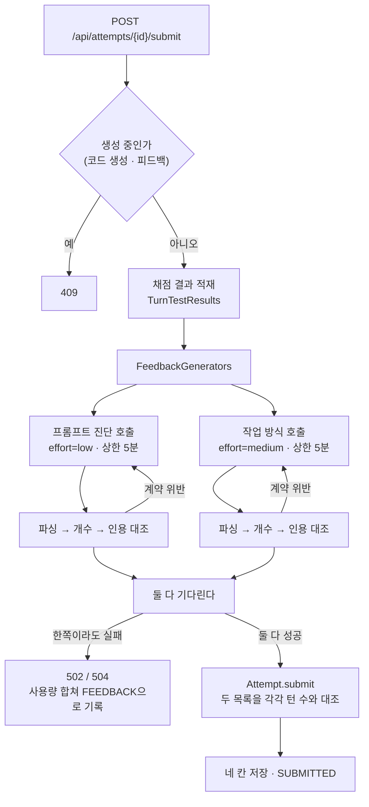

# 제출 피드백 개요

작성일: 2026-08-07

제출 한 번이 무엇을 만들고, 그것이 어떤 모양으로 사용자에게 나가는지를 한 자리에 적는다.
왜 그렇게 결정했는지의 이력은 [프롬프트 피드백 설계](feedback-design.md)와
[pattern 피드백 설계](pattern-feedback-design.md)에 있고, 이 문서는 그 둘을 잇는다.

## 1. 네 칸

사용자가 제출을 누르면 **렌즈 두 개 × 단위 두 개 = 네 칸**이 한 번에 만들어진다.

| | 턴별 (턴 수만큼) | 총평 (하나) |
|---|---|---|
| **프롬프트 진단** (코드에서 `prompt`, 저장·purpose는 `FEEDBACK`) | 요약 두 문장 + 세 절. 이 턴 프롬프트가 무엇을 전달했고 무엇이 빠졌는지 | 세션 내내 유지된 습관과 그 이유 |
| **작업 방식** (코드 전역에서 `pattern`, purpose는 `PATTERN_FEEDBACK`) | 이 턴에 일한 방식의 이름과 그 근거. 필요하면 `쓸 기법` | 세션 하나의 이름과 다음 문제에 가져갈 기법 |

네 칸이 앉는 자리도 넷이다.

| 칸 | DB | API 응답 |
|---|---|---|
| 코치 턴별 | `attempt_turn.feedback` | `turns[].feedbackMd` |
| 코치 총평 | `attempt.feedback` | `overallMd` |
| pattern 턴별 | `attempt_turn.pattern_feedback` | `turns[].patternMd` |
| pattern 총평 | `attempt.pattern_feedback` | `patternOverallMd` |

**넷은 전부 있거나 전부 없다.** 한쪽만 나온 화면은 만들지 않는다 — 사용자가 없는 쪽을 보고
원래 없는 것인지 실패한 것인지 구분할 수 없기 때문이다. 그래서 두 호출 중 하나만 실패해도 제출이
실패한다(§4).

예외는 하나, **구버전 공존**이다. pattern 도입 전에 제출된 어템프트는 pattern 두 칸이 `null`로
나가고, 턴별 피드백 도입 전에 제출된 것은 `turns`가 빈 배열이다. 기존 데이터를 마이그레이션하지
않는다.

## 2. 두 질문은 한 줄이다

두 렌즈는 같은 세션을 채점하는 두 심사위원이 아니다. **한 줄로 이어진 앞뒤**다.

```
턴 K-1의 변경 ──┐
                ├─ pattern: 이 턴 프롬프트가 앞 턴 결과를 짚었나
턴 K의 프롬프트 ─┤
                ├─ 코치: 이 프롬프트가 전달한 것이 이 턴 변경에 남았나
턴 K의 변경 ────┘
```

코치는 **한 턴 안**을 본다. pattern은 **턴과 턴 사이**를 본다. 둘을 이으면 세션이 한 줄이 된다 —
전달 → 결과 → 그 결과를 이어받는 방식 → 다음 전달.

| | 프롬프트 진단 | 작업 방식 |
|---|---|---|
| 묻는 것 | 이 프롬프트가 무엇을 전달했나 | 앞 턴이 낸 결과를 이 턴이 어떻게 다뤘나 |
| 근거 | 이 턴 프롬프트, 이 턴 변경 파일, 이 턴 채점 결과 | 앞 턴 변경 파일, 이 턴 프롬프트, 이 턴 툴콜 |
| 하는 일 | **판정** — 고정 문장 4 + 3 | **명명** — 이름 둘 중 하나, 아니면 무명 |
| 산출물 | 복사해 쓸 프롬프트 예시 | 다음에 해 볼 기법 |
| 잘한 턴 | 요약 두 문장으로 끝낸다 | 잘한 턴에도 똑같이 이름을 붙인다 |

**왜 명명이 따로 필요한가.** 턴 피드백은 문제 해결 문서다 — 고칠 것만 말한다. 그 프레임에는 잘한
턴을 담을 자리가 없고, 담으면 고칠 턴이 묻힌다. 이름은 칭찬도 지적도 아니어서 잘한 턴에 그대로
붙고, **이름이 있어야 사용자가 다시 한다.**

**이 이음매는 원래 겹쳐 있었다.** 2026-08-06 이전에는 둘 다 "다음 프롬프트가 그 선택을 짚었나"를
읽었다 — 코치 축 2의 판정 다섯 문장 중 셋이 다음 턴 반응을 증거로 썼고, pattern은 턴 N의 이름을
턴 N+1 프롬프트로 정했다. 재귀속(§3.5)으로 코치는 이 턴 안에 갇히고 pattern은 뒤를 보게 되면서
겹침이 소멸했다.

## 3. 왜 이 구성으로 굳었는가

여섯 자리 전부 **실호출이 앞선 설계를 반박해서** 지금 모양이 됐다. 순서는 반박이 온 순서고,
끝의 둘(§3.7·§3.8)은 그 지표를 어떻게 읽어야 하는지다.

### 3.1 개수는 지시가 아니라 스키마가 지킨다

턴 피드백은 턴과 1:1이어야 한다. 그것을 `description`으로만 요구하던 동안 모델이 개수를 자주
어겼다 — 6턴 세션 실패율 17%, **12턴 세션은 8/8 전부 실패**했고 부족(1 of 12)과 초과(15 of 12)
양쪽으로 어긋났다.

`minItems`/`maxItems`로 옮기자 20턴까지 어긋나지 않는다. strict 모드가 배열 개수 제약을 거부할까
봐 빼 두었던 것인데, 실제로는 400 없이 받아들인다. 파서와 도메인의 검증은 안전망으로 남겼다(§4).

### 3.2 지어내기는 인용이 막는다

지시로 "없는 사실을 쓰지 마라"고 적어도 모델은 그럴듯한 문장을 만든다. 그래서 턴마다 `quotes`를
필수로 받고 **그 문장이 입력에 정말 있었는지 코드가 대조한다.** 없으면 응답 계약 위반으로 한 번
다시 부른다.

| 수준 | 무엇을 재나 | 쓰임 |
|---|---|---|
| raw | 한 글자도 다르지 않은 복사 | 진단 로그 |
| **normalized** | 연속 공백을 한 칸으로 접고 앞뒤를 턴 것 | **계약** — 어긋나면 재호출 |
| turnScoped | 그 인용이 그 턴의 태그 블록 안에 있었나 | 진단 로그 |

줄바꿈과 들여쓰기가 다르다는 이유로 제출을 실패시키는 것은 값이 없어 계약은 normalized 하나다.
인용은 대조를 마치면 **버린다** — 저장 봉투로 넘어가지 않는다. 짚을 것이 없는 턴은 빈 배열이
정답이고, 빈 문자열은 불일치다.

### 3.3 어휘를 열어 두면 하나로 무너진다

pattern은 처음에 AI Coding Dictionary 69개를 전부 실었다. 같은 4턴 세션을 두 번 돌렸더니 **두 번 다
어휘가 하나로 무너졌다.** 한 번은 4턴 중 3턴과 총평이 전부 `primary source`였는데, 그건 원본을
가리키는 명사이지 일하는 방식이 아니다. 두 번째는 같은 자리를 `human review`가 차지했고 없는
사실까지 지어냈다.

원인은 분명하다. 쉰여덟 개는 대부분 기계 부품 이름(`token`·`context window`·`prefix cache`)이라 애초에
이름이 될 수 없는데, **목록에 있다는 것만으로 모델을 끌어당겼다.** 그래서 지시가 아니라 **정보를
뺐다** — 목록을 `Patterns of Work` 열한 개로 줄이고, 그중 **이름이 될 수 있는 것은 둘**로 못 박았다.

| 이름 | 무엇으로 관찰하는가 |
|---|---|
| `vibe coding` | 턴 K-1의 변경 파일이 턴 K 프롬프트에 이름으로 안 나온다 |
| `human review` | 턴 K가 그 파일을 짚거나 고치거나 되돌린다 |

나머지 아홉은 설명 문장과 `쓸 기법` 자리에서만 쓴다. 입력 토큰도 3,000에서 600 남짓으로 줄었다.

### 3.4 이름은 코드가 계산한다

프롬프트는 줄곧 이렇게 적어 두고 있었다.

> the evidence for them is mechanical: a file name is either in the next prompt or it is not.

**그런데 그 기계적인 일을 모델에게 시키고 있었다.** 그래서 문구와 모델이 바뀔 때마다 라벨이 통째로
뒤집혔다 — 같은 세션 다섯이 한 모델에서는 전부 `vibe coding`, 다른 모델에서는 전부 이름 없음,
문구를 넓히자 전부 `human review`가 됐다. 셋 다 틀렸고 원인은 문구가 아니라 판정 주체였다.

그래서 `PatternPrompts`가 턴 K-1의 변경 파일명이 턴 K 프롬프트에 있는지를 **경로·파일명·확장자를
뗀 이름** 셋으로 직접 보고, 결과를 `<prompt_names_previous_changed_file>` 태그로 사용자 데이터보다
**앞에** 싣는다. `String.contains`는 틀릴 수가 없다.

그것으로 틀린 이름은 사라졌지만 **기권이 남았다** — 모델이 이름을 달 때는 계산값과 100% 일치했는데,
호출의 40%가 세션 전체에서 이름을 통째로 빼먹었다. 이름을 자유 텍스트에 두었기 때문이다.

| luna, 7세션 × 2회 | 태그만 | 경쟁 지시 제거 | 스키마 enum |
|---|---|---|---|
| 이름 정확도 | 50.0% | 62.5% | **100% (32/32)** |
| 이름 없음 | 30 | 26 | **14** |
| 기법 정확도 | 40.0% | 80.0% | 80.0% |
| `vibe coding`이 아닌 턴에 붙은 기법 | 0 | 0 | 0 |
| 사용자 오귀속 | 0 | 0 | 0 |

**지시로 안 되던 것이 스키마로 됐다** — 이 저장소가 턴 개수(§3.1)에서 이미 배운 것과 같은 수다.
이름은 enum(`vibe coding` / `human review` / `""`)으로 받고, 제목 줄은 BE가 조립한다.

### 3.5 피드백은 뒤만 본다

발단은 관찰 하나였다 — **턴 1 피드백이 턴 2에 대해 말해서 이해가 안 된다.** 아직 안 읽은 턴을
사실로 주장하면 사용자가 근거를 확인할 수 없다.

원인은 문장이 아니라 귀속이었다. 판정 내용은 그대로 두고 **붙이는 턴만 한 칸 뒤로** 옮겼다 —
턴 K = (턴 K-1의 변경 ↔ 턴 K의 프롬프트). 그래서 **첫 턴이 무명이 되고 마지막 턴이 이름을 받는다**
(그전과 정반대다). 코치 축 2도 다음 턴 반응을 판정에서 빼고 다섯 문장을 셋으로 줄였다.

| luna, 7세션 × 2회 | 재귀속 전 | 재귀속 후 |
|---|---|---|
| 이름 정확도 | 100% (32/32) | **100% (32/32)** |
| 이름 없음 | 14 — 전부 마지막 턴 | **14 — 전부 첫 턴** |
| 기법 정확도 | 80% | 100% (10/10) — **이 두 칸은 비교 불가**(§3.7) |
| `vibe coding`이 아닌 턴에 붙은 기법 | 0 | **0** |
| 사용자 오귀속 | 0 | **0** |
| 계약 성공 | 27/28 | **28/28** |
| 축 2 마지막 턴 판정 | 해당 없음(전용 문장 고정) | `AI에 맡기셨어요` 10 · `방향을 정하셨어요` 3 · 없음 1 |

마지막 줄이 이 변경의 부수 소득이다. 다음 턴 반응을 증거로 쓰는 동안 마지막 턴은 늘 전용 문장으로
빠졌고 **1턴 세션은 축 2가 통째로 죽어 있었다.** 이제 마지막 턴도 판정을 받는다.

### 3.6 처방이 조회표가 되면 잔소리가 된다

`쓸 기법`은 한때 조회표였다. 프롬프트가 본문에 답을 적어 둬서(`vibe coding` is answered by
`human review`) 진단이 정해지는 순간 처방이 결정됐고, 세 턴 모두 같은 기법이 나왔다.

| | 고치기 전 | 1차 | 2차(현재) |
|---|---|---|---|
| 턴 기법 | `human review` 3 (전부 같음) | `automated check` 8 · `human review` 1 | `automated check` 2 · `human review` 4 |
| `vibe coding`이 아닌 턴에 붙은 기법 | 0 | **6** | 0 |
| 총평의 해로운 처방 | 1 | 0 | 0 |
| 사용자 발언·행위 오귀속 | 4 | 2 | **0** |

**1차가 과했다.** 답을 둘로 가르면서 "여러 턴에 같은 기법이 맞을 수 있다"고 적었더니 잘한 턴에도
처방이 붙었다 — 매 턴 잘한 세션이 턴마다 잔소리를 받는다. 2차에서 **이 절은 이름이 `vibe coding`일
때만 쓴다**고 이름으로 못 박아 되돌렸다.

지금은 답을 세션이 고르고, **2026-08-07부터 갈림이 셋이다.** 신호 둘을 교차하는데 둘은 대등하지
않다 — 실행이 끝났는지는 코드가 알아 `<turn_has_finished_run>` 태그로 싣고, 프롬프트가 그 결과를
말하는지는 텍스트에만 있어 모델이 읽는다.

| 실행 기록 | 프롬프트가 결과를 말함 | 기법 |
|---|---|---|
| 없음 | 아니오 | `automated check` — 먼저 돌려 보라 |
| 있음 | 아니오 | `human-in-the-loop` — 본 것을 프롬프트로 옮겨라 |
| 있음 | 예 | `human review` — 이제 코드를 열어라 |

가운데 칸이 이 제품 고유다. 실행 결과는 원리적으로 코드 생성 모델에 안 들어가므로 사용자가 프롬프트로
옮겨야만 도달하는데, 화면에 `채점` 탭이 있어 "돌리긴 했는데 결과를 안 쓴" 턴이 생긴다. 그 사람에게
"돌려 보라"고 하던 것이 08-07 이전의 오답이다. 자세한 것은
[pattern 피드백 설계](pattern-feedback-design.md)의 「실행 신호와 세 갈림」 절에 있다.

### 3.7 지표 자체가 틀릴 수 있다

재귀속 직후 기법 정확도가 80% → 60%로 떨어져 보였다. "회고형으로 바꾸면서 절이 사라졌다"로 읽고
프롬프트에 못을 박았더니 **40%로 더 떨어지고 용어가 하나로 무너졌다**(되돌렸다).

하네스가 생성 텍스트를 함께 남기게 하고 나서야 원인이 보였다. **절은 `vibe coding` 턴 서른 개 전부에 있었다.**
못 읽은 것은 파서다 — 모델이 용어를 백틱으로 감싸면(`` `automated check` ``) `startsWith`가 걸렸다.
여는 백틱을 벗기고 재채점하니 10/10이다.

> **위 표들의 기법 정확도 칸끼리는 비교할 수 없다.** 80%도 같은 깨진 파서로 잰 값이다. 그 차이는
> 모델이 아니라 그날 모델이 백틱을 얼마나 썼는지다.

배운 것은 지표 쪽이다 — **지표가 떨어졌을 때 생성물을 안 보고 프롬프트를 고치면, 측정 버그를 모델
탓으로 돌리고 멀쩡한 프롬프트를 망친다.**

### 3.8 병합된 판본에서 다시 쟀다 — 2026-08-07

§3.4·§3.5의 수치는 전부 **병합 전 브랜치**에서 잰 값이고, 병합되면서 절 제목이
`### 이 턴의 패턴` → `### 이 턴의 이름`으로 바뀌었다. 그래서 이 문서를 쓰며 `BE-main` 그대로
한 번 더 돌렸다(luna, 7세션 23턴 × 2렌즈 = 14호출, 1회).

| 지표 | 결과 |
|---|---|
| 계약 성공 | **14/14** |
| 인용 불일치(normalized) | **0** — 113개 인용 전부 입력에 있었다 |
| 이름 정확도 | **16/16** |
| 이름 없음 | 7 — 세션 수와 같고, 전부 첫 턴 |
| `vibe coding`이 아닌 턴에 붙은 기법 | **0** |
| 사용자 오귀속 | **0** |
| 채점 숫자 누출 | **0** |
| 첫 판정 정확도 | 17/23 (73.9%) — 아래 |

**첫 판정 73.9%를 그대로 읽으면 안 된다.** 어긋난 여섯 중 **다섯이 판정 문장이 아예 없는 턴**이고,
그 다섯은 전부 요약 두 문장으로 끝난 턴이다.

```
상태 변경만 요청하셔서 AI가 OrderService에 cancel을 추가했어요. 배송 상태 예외와 재고 복구는 이 턴의 요청에 들어 있지 않았어요.
```

이것은 설계가 명시적으로 허용한 경로다 — 지적할 게 없는 턴은 세 절을 채우지 않는다(§5.2). 하네스는
그 턴에도 판정 문장을 기대하므로 위반으로 센다. **§3.7과 같은 자리다** — 지표가 생성물을 안 보고
읽히면 멀쩡한 동작이 실패로 잡힌다. 판정 문장이 실제로 나온 18턴만 세면 **17/18**이다.

진짜 어긋남은 **23턴 중 하나**다. 근거는 이렇게 적어 놓고

```
`요구사항`과 `완료 조건`에 상태 변경만 있어 AI가 `OrderService.java`에 `cancel`과 상태 변경만 추가했어요. `SHIPPED`, `DELIVERED` 예외와 `Inventory` 재고 복구를 적지 않아 해당 동작이 빠졌어요.
```

판정이 `요청하셨지만 AI가 하지 않았어요`로 나갔다. 요청한 것(상태 변경)은 들어갔으므로 네 질문의
2번에서 잘못 멈춘 것이고, 맞는 문장은 `요청한 대로 바뀌었어요`다.

## 4. 제출 한 번의 흐름



마디마다 못 박아 둔 규칙이 있다.

| 마디 | 규칙 | 왜 |
|---|---|---|
| 재호출 | 각 생성기 안에서 **딱 한 번**. 대상은 빈 응답·JSON 파싱 실패·개수 불일치·빈 총평·인용 불일치 | 잘림은 뺀다 — 예산이 모자란 것이라 다시 불러도 같은 자리에서 잘리고 비용만 두 배가 된다 |
| 타임아웃 | 각 호출 안에서 5분. **바깥에는 두지 않는다** | 바깥에서 또 재면 자기 예산 안에서 정상 진행 중인 브랜치를 자르고, 그 브랜치가 들고 있던 사용량이 통째로 사라진다 |
| 취소 | 한쪽이 실패해도 **반대쪽을 취소하지 않는다** | `future.cancel(true)`는 바깥 스레드만 인터럽트한다. AI 호출은 안 죽고 토큰만 과금된 채 결과를 아무도 안 읽는다 — 취소는 두 번 거짓말한다 |
| executor | 태스크마다 스레드를 새로 만든다 | 바깥 둘이 안에서 다시 호출을 부르는 2단 구조라, 고정 크기 풀이면 바깥 둘이 풀을 채우고 안쪽 둘이 굶는다 |
| 개수 검증 | 파서와 `Attempt.submit`이 **두 번** 센다 | 스키마가 지키지만(§3.1) 1:1은 봉투의 계약이라 도메인에서도 막는다 |
| 실패 기록 | 두 브랜치 사용량을 합쳐 seq를 다시 매기고 `FEEDBACK` 하나로 남긴다 | 실패는 제출 한 건의 사건이다. purpose를 가르면 한 번의 실패에 마커가 둘 생겨 실패 건수 쿼리가 두 배로 읽힌다 |
| 예외 | 한쪽이 타임아웃이면 타임아웃(504)이 이긴다 | 사용자가 실제로 겪은 것은 5분을 기다린 일이다 |
| 재생성 | 없다. 조회는 저장분을 그대로 돌려준다 | "제출됐는데 반쪽"이 구버전 `null`과 구분되지 않는다 |

**생성은 제출 시 일괄이다.** 턴마다 즉시 만들 수 없는 이유는 pattern 총평이 세션 전체를 읽어야
기법을 고를 수 있기 때문이고, 만들었다면 피드백이 다음 턴 프롬프트에 섞여 들어가 평가 대상이
오염된다.

호출 옵션은 이렇게 갈린다.

| | 모델 | effort | 완성 토큰 (base + 턴당, 상한) | 캐시 키 |
|---|---|---|---|---|
| 프롬프트 진단 | `gpt-5.6-luna` | `low` | 4,096 + 2,048×턴, 32,768 | `feedback` |
| 작업 방식 | `gpt-5.6-luna` | `medium` | 8,192 + 2,048×턴, 32,768 | `pattern-feedback` |

기본 모델은 슬롯별 환경 변수로 덮인다(`OPENAI_FEEDBACK_MODEL`). 완성 토큰을 턴 수에 비례시키는
이유는 출력이 턴 수만큼 늘기 때문이고, reasoning 토큰도 같은 예산에서 나가므로 effort를 올리면 이
상한부터 다시 재야 한다. 시스템 프롬프트는 전 사용자·전 제출에서 같아 프리픽스가 통째로 캐시되고,
사용자 데이터는 그 뒤에 온다 — 두 시스템 프롬프트가 다르므로 키도 갈라야 캐시가 안 빗나간다.

## 5. 양식

### 5.1 봉투

턴 분할만 스키마로 고정하고 내용은 markdown으로 둔다. 그래야 어휘를 바꿀 때 프롬프트만 고치면 되고
스키마·DTO·FE가 함께 움직이지 않는다.

```json
{
  "turns": [{ "turn": 1, "feedbackMd": "...", "patternMd": "..." }],
  "overallMd": "...",
  "patternOverallMd": "..."
}
```

확장은 additive로만 한다 — 필드를 더하되 기존 필드의 의미·형태는 바꾸지 않고, FE는 모르는 키를
무시한다.

### 5.2 프롬프트 진단 — 턴별

요약 두 문장으로 열고 세 절이 따른다. 요약이 소제목보다 앞인 이유는 접힌 카드에서 첫 두 줄만 보고도
이 턴을 열어볼지 정할 수 있어야 하기 때문이다.

| 절 | 하는 일 |
|---|---|
| `### 프롬프트 정리하기` | 사용자 프롬프트를 [결과 형식](prompt-format.md)의 6칸에 재배치한다. 사용자 표현을 인용하고, 정보가 없는 칸은 `(없음)` |
| `### 결과와 비교하기` | 빈 칸이 이 턴 변경 파일에 남긴 흔적을 잇고, 그 뒤에 고정 판정 문장 두 개 |
| `### 다음 프롬프트 쓰기` | 개선된 프롬프트 예시. 턴 1은 6칸 전체, 턴 2+는 `직전 결과` + 바뀐 칸만 |

**지적할 게 없는 턴은 요약 두 문장으로 끝낸다.** 세 절을 형식대로 채우면 잘한 턴과 못한 턴의 분량이
같아져 어느 턴을 고쳐야 하는지가 묻힌다.

판정은 **고정 문장을 변형 없이** 내보낸다. 내부 어휘(`축 1`·`축 2`·`반영`·`위임`)는 사용자에게
노출하지 않는다.

| 첫 판정 — 요구가 결과에 담겼나 | 의미 |
|---|---|
| `요청한 대로 바뀌었어요` | 요구한 변경이 결과에 있고 동작한다 |
| `일부만 바뀌었어요` | 일부만 반영됐다. 변경은 있는데 요구한 동작을 못 하는 턴도 여기다 |
| `요청이 프롬프트에 없었어요` | 프롬프트가 요구를 전달하지 못했다 |
| `요청하셨지만 AI가 하지 않았어요` | 요구가 변경 파일에 통째로 없다 |

| 둘째 판정 — 누가 방향을 정했나 | 의미 |
|---|---|
| `방향을 정하셨어요` | 프롬프트가 방향을 정했다 |
| `AI에 맡기셨어요` | 프롬프트에 없어 AI가 정했다 |
| `이 턴에는 판단할 만한 결정 지점이 없었어요` | 명세가 열어둔 결정이 이 턴에 없다 |

판정이 흔들리지 않는 이유는 **문장을 고르는 절차까지 프롬프트가 지정하기 때문**이다. 인상으로 고르지
말고 네 질문을 순서대로 걸어 첫 `yes`에서 멈추게 한다.

```
Walk these four questions in order and stop at the first yes. Do not pick by impression.
1. Did this turn's prompt ask for no change at all ...? Then `요청이 프롬프트에 없었어요` ...
2. Is the requested change missing from this turn's changed files entirely ...? Then `요청하셨지만 AI가 하지 않았어요` ...
3. Did part of the request stay out, or did something land that the prompt never asked for? Then `일부만 바뀌었어요` ...
4. None of the above? Then `요청한 대로 바뀌었어요`.
```

그 위에 **모순 짝 목록**이 얹힌다. 근거와 판정이 어긋나는 조합을 미리 이름으로 금지한다.

```
These pairings contradict what you wrote — never send them:
- the summary or the ground says the requested change is in the files, and you wrote `요청하셨지만 AI가 하지 않았어요` or `요청이 프롬프트에 없었어요`
- the summary or the ground says the AI went past what the prompt asked for ... and you wrote `요청한 대로 바뀌었어요`. That turn is `일부만 바뀌었어요`
- the ground only says the prompt was thin or a label was empty, and you wrote `요청이 프롬프트에 없었어요` ...
- the summary or the ground names a choice the AI settled on its own, and you wrote `이 턴에는 판단할 만한 결정 지점이 없었어요`
```

**채점 결과는 판정의 근거로만 읽는다.** 통과 개수·비율·정답 여부는 사용자에게 나가지 않는다 —
사용자는 실행 화면에서 이미 그 숫자를 본다. 실패한 테스트 **이름**은 허용한다. 그것은 채점이 아니라
어느 동작이 아직 빠졌는지를 말하는 근거다. 채점기가 스스로 죽은 턴(`RUNNER_ERROR`)은 언급 자체를
금지한다 — 누구에 대한 정보도 아니다.

### 5.3 작업 방식 — 턴별

```
### 이 턴의 이름          ← BE가 조립한다
vibe coding — 앞 턴에서 바뀐 코드를 열지 않고 다음 요구만 이어 간 방식이에요
<모델이 쓴 근거 문장 두세 개>

### 쓸 기법               ← 이름이 vibe coding일 때만
human review — 이 턴 프롬프트를 쓰기 전에 …했다면 그게 human review예요
```

제목 줄과 이름은 **모델이 쓰지 않는다.** 이름은 계산값(§3.4)이고 스키마 enum으로 받는다.

```json
"name": {
  "type": "string",
  "enum": ["vibe coding", "human review", ""],
  "description": "이 턴의 이름. prompt_names_previous_changed_file 태그의 named 값을 그대로 옮긴다 ..."
}
```

모델의 몫은 **근거 문장**과 이 턴에 맞춘 뜻풀이(`gloss`) 한 줄이다. `쓸 기법`은 이름이
`vibe coding`인 턴에만 붙는다 — 이미 잘한 턴에 처방을 얹으면 잔소리가 된다(§3.6).

용어 표기는 `원어 — 한국어 풀이`이고 **원어는 절대 번역하지 않는다.** 사용자가 다음 문제에 가져가는
것이 그 영어 이름이기 때문이다.

이 렌즈만 **툴콜 트레이스**를 입력에 싣는다. `list_files` 뒤에 `read_file`이 여럿 따르면 프롬프트가
대상을 안 짚어 AI가 찾아다닌 것이고, 그건 결과에 안 남는 근거다. 반대로 트레이스의 모든 줄은
**AI가 한 일**이라, 그것을 사용자가 한 일로 적는 것을 프롬프트가 예문으로 막는다.

### 5.4 총평 둘

| | 다루는 것 | 두지 않는 것 |
|---|---|---|
| 프롬프트 진단 총평 | 세션 전체의 패턴 — 위임 반복, `직전 결과` 습관, 턴에 따른 프롬프트 진화. 잘한 점과 최우선 개선 1~2개 | 프롬프트 예시. 그건 턴별 `다음 프롬프트 쓰기`의 몫이다 |
| 작업 방식 총평 | `### 이번 세션의 이름`(+ 그 이름을 받치는 턴 번호)과 `### 다음 문제에 가져갈 것` | 세션 이름과 같은 용어. `vibe coding`은 가져갈 것이 될 수 없다 |

총평은 고칠 목록이 아니라 **왜 그 패턴이 세션 내내 유지됐는지**를 설명하는 글이다. 턴 피드백은 문제
해결 문서, 총평은 깊은 이해 문서다.

작업 방식 총평 뒤에는 출처 한 줄을 **BE가** 붙인다. 모델에게 맡기면 나오다 말다 해서 화면이 흔들린다.

### 5.5 실물

아래는 2026-08-07에 병합된 `BE-main`으로 실제 모델을 불러 받은 **같은 세션 같은 턴**이다.
소재는 하네스 픽스처 `S7-실행확인` — 사용자가 코드를 안 읽고 실행 결과만 말하는 3턴 세션이고,
발췌한 것은 턴 2다. 실제 사용자 세션이 아니라 측정용으로 손으로 짠 세션이다.

프롬프트 진단은 **이 턴 안**을 말한다.

````markdown
배송이 시작된 주문을 거부하는 검사는 OrderService.cancel(Long orderId)에 추가됐지만, 이 턴에서 요청하지 않은 재고 복구는 아직 빠져 있어요. 직전 결과와 이번에 고칠 동작을 함께 적으면 남은 실패 동작을 이어서 지정할 수 있어요.

### 프롬프트 정리하기
- 직전 결과: 취소하면 상태는 바뀌는데, 배송이 시작된 주문도 그냥 취소돼요
- 요구사항: 배송이 시작된 주문은 IllegalStateException으로 취소를 거부함

### 결과와 비교하기
요구사항이 SHIPPED와 DELIVERED 주문의 취소 거부를 정하지 않았지만, 이번 요청은 배송 시작 주문의 예외 처리만 명시했어요. AI가 OrderService.cancel(Long orderId)에 그 동작을 추가했고, 재고 복구는 이번 턴의 요청 범위에 없었어요.
요청한 대로 바뀌었어요
방향을 정하셨어요

### 다음 프롬프트 쓰기
```text
직전 결과
- 배송 건은 막히지만 취소해도 재고가 그대로예요

요구사항
- 취소 가능한 주문을 취소하면 Inventory 재고를 Order.quantity만큼 복구함
- 재고 복구 대상 SKU는 Order.sku임
- SHIPPED와 DELIVERED 주문은 예외를 던지고 재고를 복구하지 않음

작업 대상
- OrderService.cancel(Long orderId)
- Inventory

제약
- Order, OrderService, Inventory 밖의 파일은 수정하지 않음
- 기존 배송 상태 거부 동작은 유지함

완료 조건
- 취소 가능한 주문의 상태가 CANCELED가 됨
- 취소 가능한 주문의 해당 SKU 재고가 주문 수량만큼 증가함
- 배송 중 주문의 상태와 재고가 바뀌지 않음

검증
- 재고 복구와 배송 중 취소 거부를 다시 확인함
- 실행할 수 없는 검증은 그 이유를 보고함
```
````

작업 방식은 **앞 턴과의 사이**를 말한다. 같은 턴이고, 겹치는 문장이 없다.

```markdown
### 이 턴의 이름
vibe coding — 앞선 변경 파일의 diff를 읽지 않고 실행 결과만 전달했어요.
턴 1에서 AI가 `src/main/java/com/shop/OrderService.java`에 `cancel(Long orderId)`를 추가했어요. 턴 2에서 사용자가 실행 결과를 말했지만, 이 턴 프롬프트에는 `src/main/java/com/shop/OrderService.java`가 나오지 않아요.

### 쓸 기법
human review — 이 턴 프롬프트를 쓰기 전에 사용자가 턴 1에서 AI가 고친 `src/main/java/com/shop/OrderService.java`의 diff를 읽고 배송 상태 검사 위치를 짚었다면 human review예요.
```

같은 세션 **턴 1**의 작업 방식은 한 문장이다. 첫 턴에는 짚을 앞선 결과가 없어 이름이 없다(§3.5).

```markdown
첫 턴이라 앞선 결과가 없어요.
```

### 5.6 문체는 공유하고 예문은 안 한다

두 렌즈가 `FeedbackWritingStyle.section(...)`을 같이 쓴다 — 사용자가 한 화면에서 둘을 나란히 읽으므로
한쪽만 고치면 목소리가 갈린다.

| 항목 | 규칙 |
|---|---|
| 어미 | 해요체. 서술 `~해요`, 권유 `~하세요` |
| 주어 | 사용자가 한 일은 `~하셨어요`, AI가 한 일은 `AI가 ~했어요`. 프롬프트·파일·시스템을 주어로 쓰지 않고 피동형도 안 쓴다 |
| 단어 | 파생 명사 대신 동사. 연결어와 모호어 금지 |
| 구체성 | 파일·메서드·값을 이름으로 부르고, 빠진 것도 이름으로 말한다 |
| 시제 | 관찰은 지난 사실, 처방은 다음에 쓸 것. `~했어야 해요`는 안 쓴다 |
| 분량 | 절당 네 문장 |

**규칙만 공유하고 예문은 렌즈마다 자기 소재로 갖는다.** 예문까지 공유했더니 코치의 6칸 프레임 문장
(`제약 칸이 비어 있어요`)이 pattern 프롬프트에 그대로 실려, "프롬프트를 라벨로 분류하지 마라"는
규칙을 예문이 반박했다. **예문이 규칙보다 세게 가르친다** — 이 저장소가 두 번 비싸게 배운 것이고,
그래서 예문은 항상 짝(`쓰지 말 것`/`이렇게`)으로 고친다.

해요체는 사용자에게 보이는 피드백 문장에만 적용한다. 형식 문서의 기본 문구, 예외 메시지, 로그는
그대로 둔다 — 그 문장들의 독자는 사용자가 아니다.

## 6. 화면

`/attempts/{id}/feedback` 한 페이지에 네 칸이 다 있다. 총평 둘은 세로로 쌓이고, 그 아래 턴 탭이
턴 하나를 골라 네 칸 그리드를 연다.

```
┌──────────────────────────────────────────────┐
│ 프롬프트 진단 총평                            │
├──────────────────────────────────────────────┤
│ 작업 방식 총평                                │
├──────────────────────────────────────────────┤
│ 턴 고르기 │ 턴 1 │ 턴 2 │ 턴 3 │ …           │  ← role=tablist
├────────────────────┬─────────────────────────┤
│ 생성된 코드         │ 작성한 프롬프트          │
├────────────────────┼─────────────────────────┤
│ 프롬프트 진단       │ 작업 방식                │  ← 두 렌즈가 여기서 나란히
│ "무엇을 전달했고    │ "이 턴에 일한 방식과,    │
│  무엇이 빠졌는지"   │  다음에 써 볼 기법"      │
└────────────────────┴─────────────────────────┘
```

두 렌즈를 좌우로 놓는 배치가 §2의 척추를 그대로 드러낸다 — 같은 턴에서 왼쪽은 이 턴 안을, 오른쪽은
앞 턴과의 사이를 말한다. 그 위 두 칸(생성된 코드·작성한 프롬프트)이 둘의 근거다.

**pattern은 경계에서 한 번 정규화한다.** 응답을 받아 총평과 **모든 턴**이 다 찼는지 확인하고
`{overallMd, turnMd}` 또는 `null`을 돌려준다. 한 자리라도 비면 통째로 숨기고 `console.warn`만 남긴다.
처음엔 총평 한 필드로 판정해 턴 칸까지 켰는데, 그리는 값은 다른 필드라 렌더 자리에 `?? ''`가 남았다 —
계약이 지켜지면 죽은 코드, 깨지면 설명 없는 빈 칸이다. 판정은 한 번이고 렌더 자리는 `string`만 본다.

## 7. 대가와 남은 흠

| 대가 | 무엇을 얻었나 |
|---|---|
| **제출 실패율이 대략 두 배** — 두 호출 다 성공해야 저장된다 | 반쪽짜리 화면이 없다. 각 생성기 안의 1회 재호출이 그 절반을 되돌린다 |
| **재생성 경로가 없다** — 제출은 한 번, 조회는 저장분 그대로 | "제출됐는데 반쪽"이라는 상태가 구버전 `null`과 섞이지 않는다 |
| **판정 어휘가 닫혀 있다** — 고정 문장 7개, 이름 2개 | 같은 상태에 다른 이름이 붙지 않는다. 대신 그 일곱으로 표현 못 할 상황은 표현되지 않는다 |
| **입력이 매 제출마다 크다** — 명세·스켈레톤·전 턴의 프롬프트·변경·툴콜 | 근거를 인용으로 대조할 수 있다. 프리픽스 캐시가 시스템 프롬프트분을 덜어낸다 |

남은 흠 넷. 1~3은 2026-08-07 실측(§3.8)에서 눈으로 확인한 것이다.

1. **프롬프트 예시가 코드 블록 없이 나오는 턴이 있다.** 18턴 중 8턴이 그랬고, 세션 단위로 갈렸다 —
   한 세션은 전 턴이 블록을 쓰고 다른 세션은 전 턴이 안 쓴다. 프롬프트는 `in a code block`을
   요구하고, 그 블록은 **사용자가 형식을 보는 유일한 자리**라고 스스로 적어 두었다. 그중 두 세션은
   `프롬프트 정리하기`의 값까지 백틱으로 감쌌다. 지금 알려진 것 중 가장 큰 흠이고 별도 MR 후보다.
2. **판정 근거와 결론이 드물게 어긋난다.** 23턴 중 1턴이 그랬다(§3.8). `low` effort의 한계이고,
   올리려면 완성 토큰 상한부터 다시 재야 한다(§4).
3. **하네스가 "요약 두 문장으로 끝낸 턴"을 판정 누락으로 센다.** 설계가 허용한 경로라 위반이 아닌데
   첫 판정 정확도를 73.9%로 보이게 한다 — 판정 문장이 나온 턴만 세면 17/18이고, 20%p 넘는 차이가
   전부 이 셈에서 온다. 지표 쪽 흠이고 역시 별도 MR 후보다.
4. **"읽었다"와 "돌려 봤다"의 경계가 흔들린다.** 같은 입력을 세 번 돌렸을 때 15턴 중 13턴이 세 번 다
   같은 판정을 받았고, 흔들린 둘은 정확히 그 경계였다 — 다음 프롬프트가 실행 결과만 말하는 턴,
   앞 턴의 결정을 되돌리는 턴. 이름 어휘를 둘로 좁힌 결정이 이 경계를 한 이름 안에 접어 둔 대가다.

## 8. 더 읽을 것

- [프롬프트 피드백 설계](feedback-design.md) — 코치 렌즈의 결정 기록. 두 축의 판정 경계, 채점 결과가
  들어오며 경계가 옮겨간 자리, 남용 방지 규칙.
- [pattern 피드백 설계](pattern-feedback-design.md) — 작업 방식 렌즈의 결정 기록. 어휘를 닫은 실측,
  이름을 코드로 옮긴 경위, 두 호출을 합치는 곳.
- [결과 형식](prompt-format.md) — 코치가 코칭해 가는 6칸. 라벨 이름은 이 문서가 계약이다.
