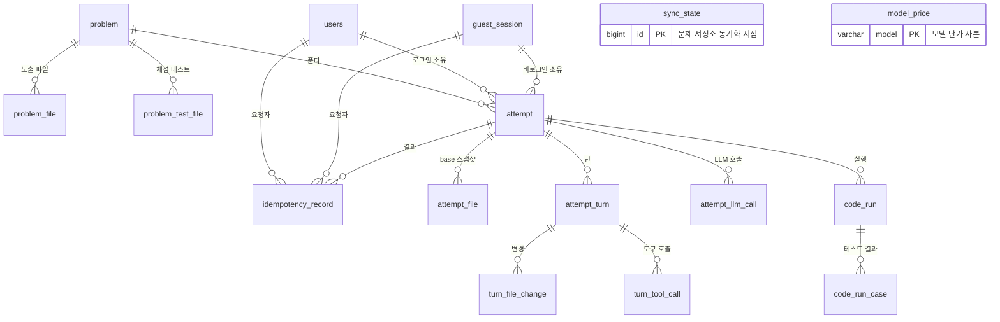
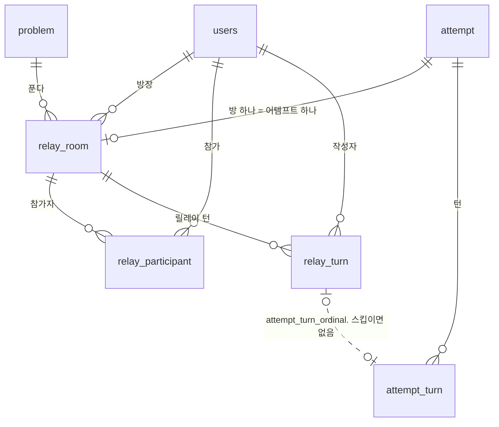
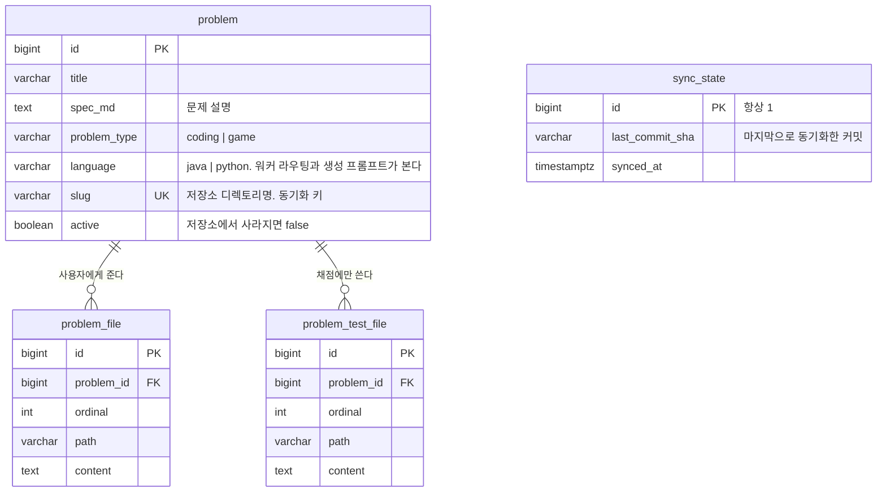
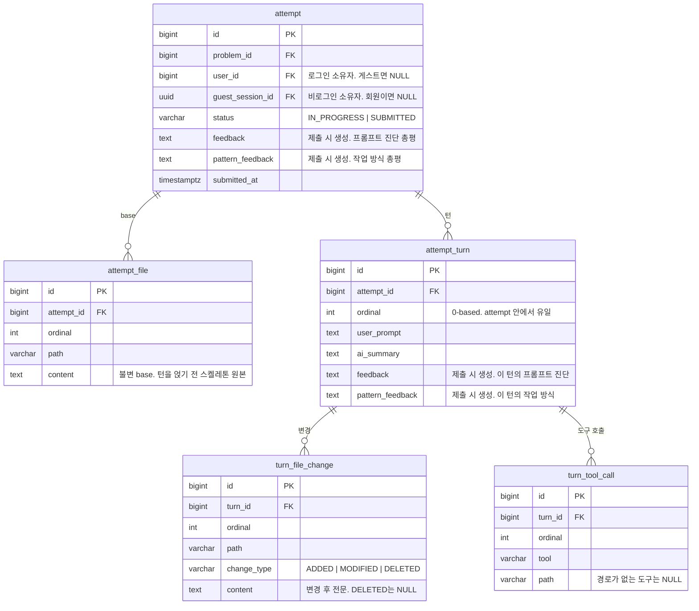
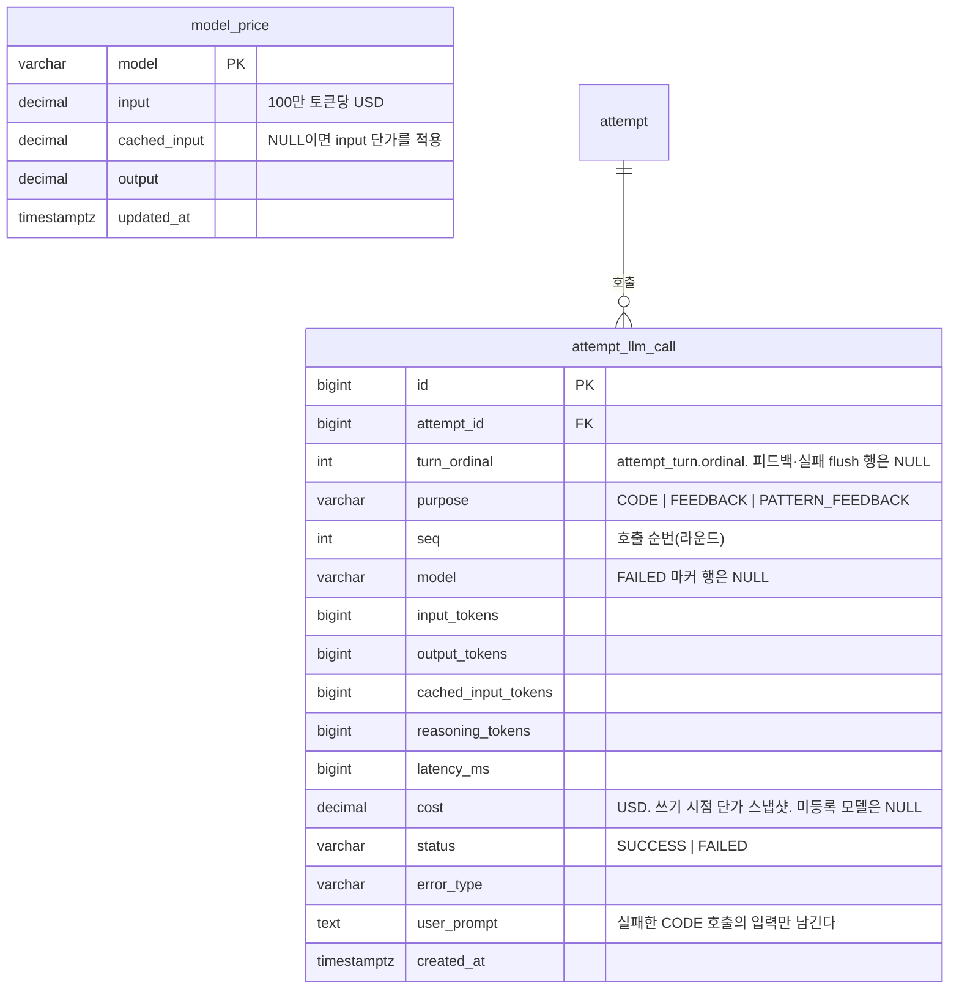
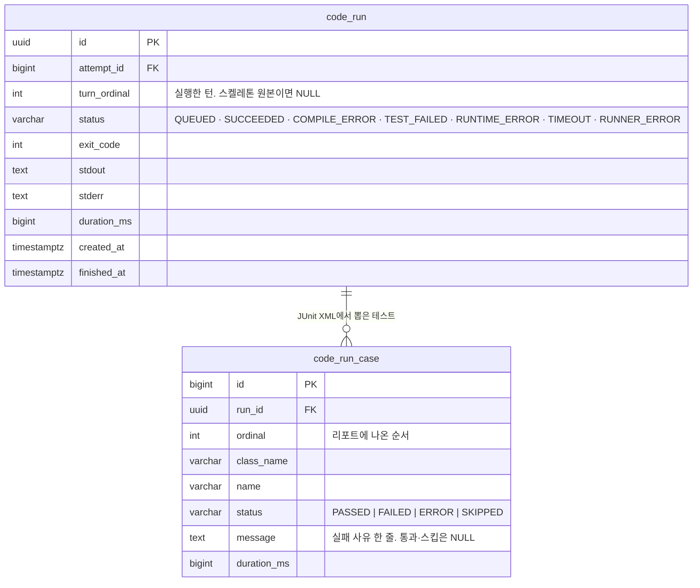
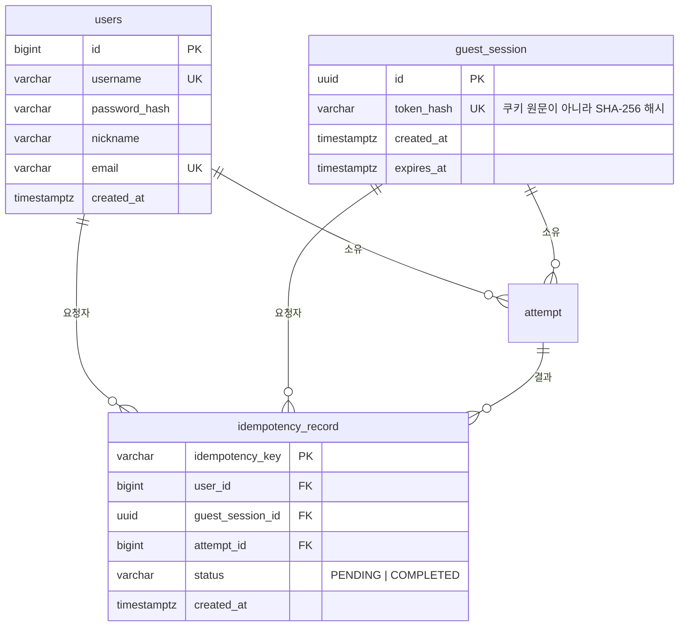
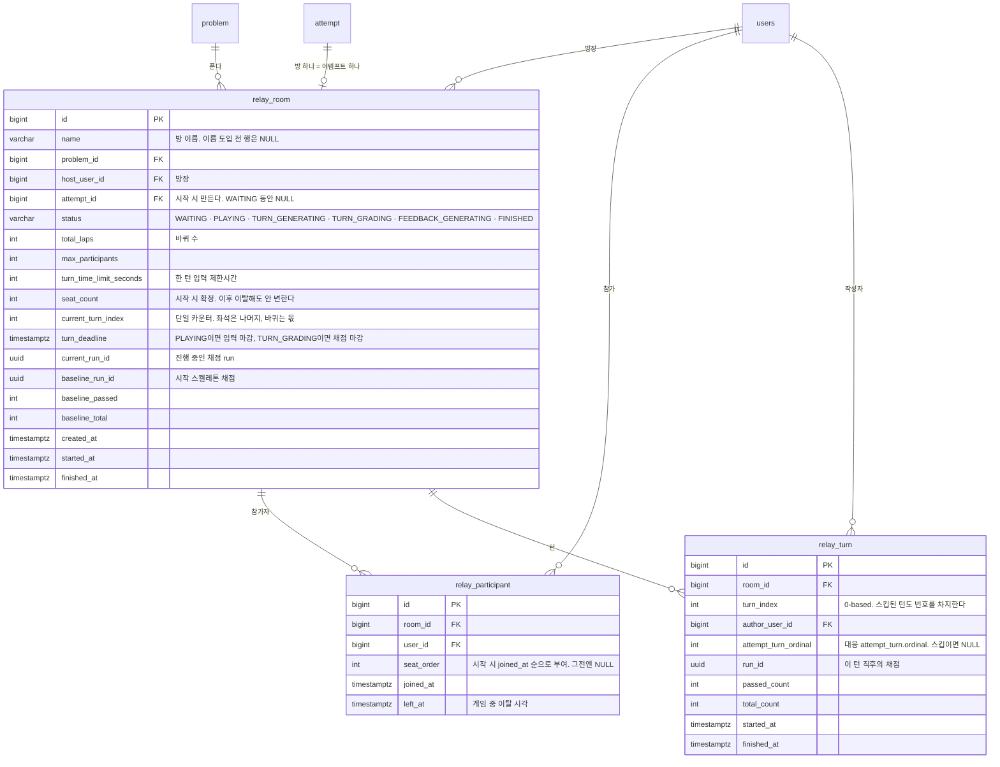

# ERD

Prompt Studio는 **코드를 직접 쓰지 않고 LLM에게 프롬프트를 넣어** 코딩 문제를 푸는 서비스다.
프롬프트 한 번이 턴 하나가 되고, 턴이 쌓이면서 코드가 자란다. 빌드와 테스트는 별도 워커가 맡고,
제출하면 LLM이 그 세션의 프롬프트를 되짚어 피드백을 만든다. 여러 명이 한 문제를 순서대로 이어
푸는 릴레이 모드도 있다.

테이블 19개, 외래키 22개. 스키마의 진실은 `backend/src/main/resources/schema.sql` 하나다 —
`ddl-auto: none`이라 엔티티 애노테이션이 테이블을 만들지 않는다.

## 1. 전체 관계도

축은 하나다. `problem` → `attempt` → `attempt_turn`, 나머지는 전부 여기 붙는 곁가지다.

`sync_state`와 `model_price`만 외래키가 없다. 둘 다 바깥의 진실을 부팅 때 베껴 온 사본이라
그렇다 — 앞은 문제 저장소의 커밋 SHA, 뒤는 설정 파일의 모델 단가다.

릴레이는 이 축을 그대로 쓰고 방과 순서만 얹는다. `attempt`와 `attempt_turn`은 어디에 붙는지
보이려고 다시 그린 것이다. 점선이 두 축을 잇는 자리인데, 외래키가 아니라 번호로 잇는다(§3).

## 2. 영역별

### 문제

GitLab 문제 저장소를 동기화해 채운다. `slug`가 저장소 디렉토리명이자 동기화 키다.

파일 테이블이 둘로 나뉜 것이 핵심이다. `problem_file`은 사용자에게 주고 `problem_test_file`은
채점에만 쓴다. 한 테이블이면 채점 테스트가 노출 경로에 딸려 나간다.

### 풀이

**어느 시점의 코드도 저장하지 않는다.** `attempt_file`은 턴을 얹기 전 스켈레톤 원본이고 변하지
않는다. `ordinal = K`인 턴 직후의 코드는 이 base에 `ordinal`이 0부터 K까지인 턴들의
`turn_file_change`를 순서대로 얹어 만든다.

얹는다는 것은 diff 병합이 아니라 **`path`를 키로 한 덮어쓰기**다. `content`가 변경 후 전문이고,
`DELETED`는 그 경로를 지운다. 한 턴 안에서는 `turn_file_change.ordinal` 순으로 적용한다.

현재 코드를 따로 들고 있으면 변경 이력과 어긋날 수 있는데, 파생시키면 어긋날 자리가 없다.

### LLM 호출과 비용

호출 1건이 1행이다. 어템프트에 누적 컬럼을 두지 않고 합계는 조회할 때 SUM으로 만든다.

`cost`만 예외로 쓰기 시점 단가를 계산해 박아둔다. 단가는 바뀌어도 그 호출이 얼마였는지는 바뀌면
안 되기 때문이다.

### 실행과 채점

워커가 JUnit 리포트에서 뽑아 보낸 테스트를 케이스 단위로 쌓는다. 통과 개수도 컬럼이 아니라 조회할
때 센다.

`WHERE status = 'QUEUED'` 부분 유니크 인덱스가 어템프트당 미완료 실행을 하나로 묶는다. 동시 요청
레이스를 DB가 막는다.

### 계정과 소유권

로그인 없이도 문제를 풀 수 있어서 소유자가 둘로 갈린다. `users` 아니면 `guest_session`,
**정확히 하나**다. 서비스 계층과 별개로 CHECK 제약이 DB에서 보장한다.

게스트 쿠키는 원문을 저장하지 않고 SHA-256 해시만 남긴다. 테이블명이 `users`인 것은 `user`가
PostgreSQL 예약어이기 때문이다.

`idempotency_record`는 같은 요청이 두 번 들어와도 어템프트가 둘 생기지 않게 막는다. 클라이언트가
보낸 키를 PK로 잡아 두고, 이미 있으면 새로 만드는 대신 그때 만든 `attempt_id`를 돌려준다.

### 릴레이

여러 명이 한 문제를 순서대로 이어 푸는 게임 모드. `relay_*` 셋은 **사이드카**다 — 프롬프트·생성
코드·파일 변경·채점은 방이 가리키는 어템프트가 그대로 담당하고, 이 셋은 방·순서·진행 단계만
들고 있다. 게임을 붙이면서 기존 코드 진화 인프라를 건드리지 않았다.

좌석과 바퀴는 컬럼으로 두지 않고 `current_turn_index` 하나에서 파생한다 — 좌석은
`current_turn_index % seat_count`, 바퀴는 `current_turn_index / seat_count`다. 따로 저장하면
둘이 어긋날 수 있다.

점수는 예외로 저장한다. `relay_turn.passed_count`는 `code_run_case`를 세면 나오는 값인데도
턴마다 복사해 둔다. 릴레이 점수가 **직전 턴 대비 증가분**이라 뺄셈의 양쪽이 그 시점 값으로
남아 있어야 하기 때문이다. `relay_room.baseline_*`은 그 뺄셈의 출발점 — 스켈레톤이 이미
통과시키는 테스트가 있으면 기준선 없이는 첫 주자 점수가 부풀려진다.

참가자는 `users` FK라서 **로그인해야 릴레이에 들어갈 수 있다.** 게스트로는 혼자 푸는 것만 된다.

## 3. 설계 판단

| 판단 | 어디에 | 왜 |
| --- | --- | --- |
| 코드는 저장하지 않고 재생한다 | `attempt_file` + `turn_file_change` | 불변 base에 변경을 얹으면 이력과 어긋날 자리가 없다 |
| 집계는 세고, 단가만 박는다 | `attempt_llm_call`, `code_run_case` | 원본 행이 진실이다. 다만 "그때 얼마였는가"는 변하면 안 되므로 `cost`만 스냅샷 |
| 소유자는 정확히 하나 | `attempt`, `idempotency_record`의 CHECK | 로그인과 비로그인이 한 행에 섞이면 조회가 두 갈래로 갈라진다 |
| 턴 연결은 외래키가 아니라 번호로 | `attempt_llm_call`·`code_run`의 `turn_ordinal`, `relay_turn`의 `attempt_turn_ordinal` | NULL이 "대응하는 턴이 없다"는 뜻을 갖는다 — 피드백 호출, 스켈레톤 원본 실행, 스킵된 릴레이 턴. 릴레이는 `attempt_id`를 방이 들고 있어 복합 키를 만들 수도 없다 |
| 릴레이는 사이드카 | `relay_*` | 게임을 붙이며 코드 진화 인프라를 그대로 재사용한다 |

---

다이어그램은 이 문서 안의 mermaid가 원본이다. 슬라이드에 넣을 PNG가 필요하면
`node docs/render-erd.mjs <출력_디렉토리>`로 뽑는다.
