# 화면 기획서 — 모두의 프롬프트

| 항목 | 내용 |
| --- | --- |
| 대상 서비스 | 모두의 프롬프트 — <https://lets.promptpractice.run> |
| 기준 | `origin/FE-main` (`27472fc`, 2026-08-10). 배포본과 같은 코드임을 확인하고 찍었다 |
| 범위 | 라우터에 등록되어 실제로 동작하는 화면 11종 / 라우트 12개 |
| 근거 | 화면 그림은 그날 배포본에서 찍은 것이고, 수치와 문구는 구현 코드에서 뽑았다. 계획만 있고 아직 없는 화면은 이 문서에 없다 |
| 이미지 | `docs/screenshots/` — 캡쳐 조건과 목록은 [그쪽 README](screenshots/README.md)에 |

> 이 저장소의 `BE-main` 브랜치에 들어 있는 `frontend/`는 `FE-main`보다 뒤처져 있다.
> 라우트 구성부터 다르므로 대조할 때는 `FE-main`을 봐야 한다.

---

## 1. 제품 개요

프롬프트 하나로 코드를 얻어내는 연습을 하고, 그 프롬프트가 왜 통했는지 / 무엇이
모자랐는지 항목별로 피드백을 받는 서비스다.

화면 이름부터 정리해 둔다. 문제를 한 번 붙잡은 것이 **어템프트** 하나이고, 그 안에서
프롬프트를 한 번 보내는 것이 **턴** 하나다. 어템프트 하나에 턴이 여럿 쌓이고, 제출하면
그 어템프트는 닫힌다. 어템프트를 시작할 때 놓이는 초기 파일들이 **스켈레톤**이다.

화면 구조를 결정한 성질은 넷이다.

1. **혼자 푸는 길은 로그인이 필요 없다.** 문제 풀이·실행·피드백까지 인증 없이 된다.
   보호되는 화면은 마이페이지와 릴레이뿐이다.
2. **AI 실행은 수 분이 걸린다.** 그래서 실행 중에 화면을 통째로 덮지 않고, 중복
   호출을 막는 장치(`Idempotency-Key`)를 넣는다.
3. **서버 상태가 정본이다.** 진행 상황은 브라우저 저장소가 아니라 주소(URL)에 담기고,
   화면은 그 주소를 보고 서버에서 다시 읽는다. 새로고침·북마크·링크 공유가 다 된다.
4. **제출한 풀이는 공개된다.** 랭킹에서 남의 기록을 눌러 그 사람의 프롬프트와 코드,
   피드백까지 읽을 수 있다. 비용이 적은 순으로 줄을 세우는 것이 랭킹이므로, 잘한
   프롬프트를 남이 읽을 수 있어야 의미가 있다.

---

## 2. 화면 목록과 이동 흐름

| # | 라우트 | 화면 | 인증 | 비고 |
| --- | --- | --- | --- | --- |
| 1 | `/` | 랜딩 | 불필요 | 섹션 5개 풀스크롤 |
| 2 | `/problems` | 문제 목록 | 불필요 | `?category=java&page=N` |
| 3 | `/problems/:problemId` | 작업장 (시작 전) | 불필요 | 3번·4번은 **같은 컴포넌트** |
| 4 | `/attempts/:attemptId` | 작업장 (진행 중·제출됨) | 불필요 | 첫 실행 시 3번에서 자동 이동 |
| 5 | `/attempts/:attemptId/feedback` | 프롬프트 피드백 | 불필요 | |
| 6 | `/ranking` | 랭킹 | 불필요 | `?problem=N&page=N` |
| 7 | `/login` | 로그인 | 불필요 | |
| 8 | `/signup` | 회원가입 | 불필요 | |
| 9 | `/my` | 마이페이지 | **필요** | `?sort=latest\|oldest` |
| 10 | `/relay` | 릴레이 로비 | **필요** | |
| 11 | `/relay/rooms/:roomId` | 릴레이 방 | **필요** | 상태 6개를 한 주소가 다 맡는다 |
| 12 | `/error` | 오류 안내 | 불필요 | `location.state`로 사유 전달 |

매칭되는 라우트가 없는 주소에는 전용 화면이 없다. react-router의 기본 오류 화면이
그대로 나온다(`screenshots/16-notfound.png`).

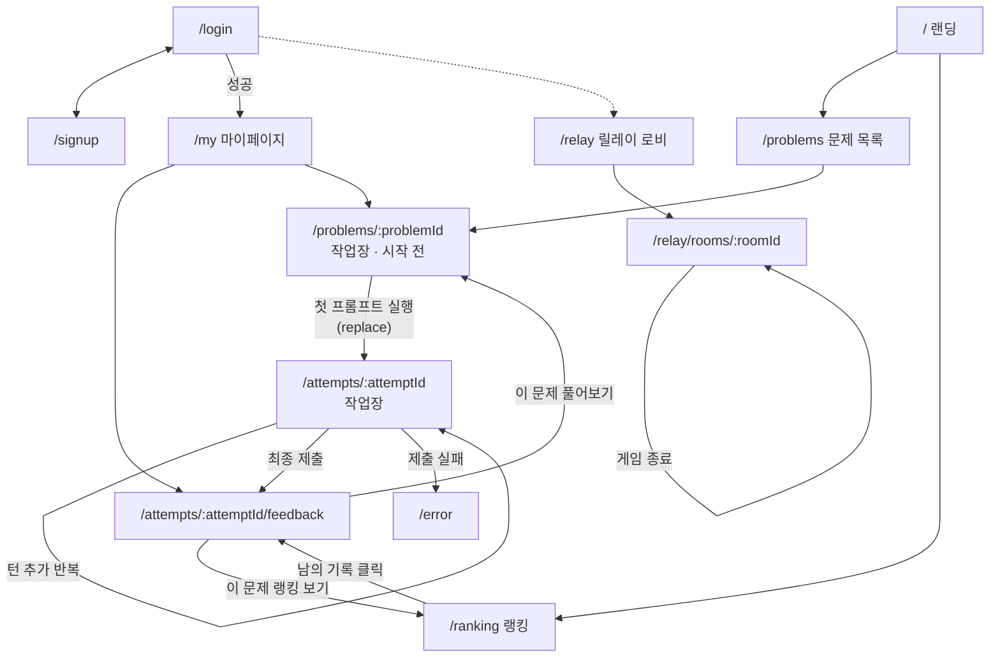
```mermaid
flowchart TD
    Home["/  랜딩"] --> List["/problems  문제 목록"]
    Home --> Ranking["/ranking  랭킹"]
    List --> Detail["/problems/:problemId<br/>작업장 · 시작 전"]
    Detail -- "첫 프롬프트 실행<br/>(replace)" --> Attempt["/attempts/:attemptId<br/>작업장"]
    Attempt -- "턴 추가 반복" --> Attempt
    Attempt -- "최종 제출" --> Feedback["/attempts/:attemptId/feedback"]
    Attempt -- "제출 실패" --> Error["/error"]
    Ranking -- "남의 기록 클릭" --> Feedback
    Feedback -- "이 문제 랭킹 보기" --> Ranking
    Feedback -- "이 문제 풀어보기" --> Detail

    Login["/login"] <--> Signup["/signup"]
    Login -- "성공" --> My["/my  마이페이지"]
    My --> Feedback
    My --> Detail
    Login -.-> Relay["/relay  릴레이 로비"]
    Relay --> Room["/relay/rooms/:roomId"]
    Room -- "게임 종료" --> Room
```

**설계 하나** — 3번과 4번 라우트는 같은 컴포넌트를 렌더하는 최상위 형제 라우트다.
덕분에 첫 실행에서 `/problems/5` → `/attempts/123`으로 주소가 바뀌어도 리마운트가
없고, 수 분짜리 AI 요청이 끊기지 않는다. 둘 중 하나를 레이아웃 라우트로 감싸거나
`key`를 붙이면 이 성질이 조용히 깨진다.

---

## 3. 공통 요소

### 헤더

전 화면 공통이고, 로그인 상태를 스스로 읽어 오른쪽을 바꾼다.

| 위치 | 비로그인 | 로그인 |
| --- | --- | --- |
| 왼쪽 | `모두의 프롬프트` (홈으로) | 같음 |
| 가운데 | 문제 목록 · 릴레이 · 랭킹 | 같음 |
| 오른쪽 | 테마 토글(`LIGHT`/`DARK`) · 로그인 | 테마 토글 · 계정 아이콘 → 마이페이지 / 로그아웃 |

- 세션을 확인하는 동안에는 인증 메뉴를 **그리지 않는다.** 게스트 메뉴가 잠깐 보였다
  바뀌는 깜빡임을 막는다.
- 로그아웃은 홈으로 먼저 이동한 뒤 요청한다. `/my`에서 순서를 바꾸면 보호 라우트의
  리다이렉트와 경합한다.
- 화면 전체를 칼럼으로 쓰는 동안에는 헤더를 고정하지 않는다(`variant="workspace"`).
  작업장이 늘 그렇고, 릴레이 방은 게임이 도는 동안만 그렇다.

### 푸터

`© 2026 모두의 프롬프트. All rights reserved.` 한 줄. 작업장에는 없고, 릴레이 방에는
대기실과 종료 화면에만 있다 — 게임이 도는 동안에는 헤더와 함께 사라진다.

### 버튼

`primary`(강조색 배경) / `secondary`(투명 + 테두리) / `ghost` 세 가지. 최소 높이
44px, 비활성 시 흐려진다. `to`를 주면 링크로, 아니면 버튼으로 렌더된다.

### 페이지네이션

`[<<] [<] [1] … [>] [>>]`, 한 그룹에 5페이지씩. 문제 목록(10개/쪽), 랭킹(10개/쪽),
마이페이지 제출 기록(5개/쪽)이 같은 컴포넌트를 쓴다. 릴레이 로비의 방 목록만
자체 화살표를 쓴다(3개/쪽).

### 테마

다크가 기본이다. 선택은 `localStorage['prompt-practice-color-mode']`에 저장되며,
운영체제 설정(`prefers-color-scheme`)은 보지 않는다. 강조색은 라임
(`#d6ff50`)이고, 라이트 모드에서는 배경이 크림색으로 바뀌면서 제목이 강조색
그림자를 얻는다.

| 용도 | 다크 |
| --- | --- |
| 배경 | `#090909` |
| 강조 | `#d6ff50` |
| 본문 / 보조 텍스트 | `#f5f5ef` / `#a3a3a3` · `#777` |
| 오류 | `#ff786b` |
| 코드 뷰어 배경 | `#202020` |
| 본문 서체 | Arial, 'Noto Sans KR', sans-serif |
| 라벨·코드 서체 | 모노스페이스 (대문자, 자간 `0.08em`) |

영문 대문자 모노스페이스를 라벨로, 큰 국문 볼드를 제목으로 쓰는 대비가 전 화면에
반복된다. 강조색은 "지금 누를 수 있는 것"과 "지금 보고 있는 것"에만 쓴다.

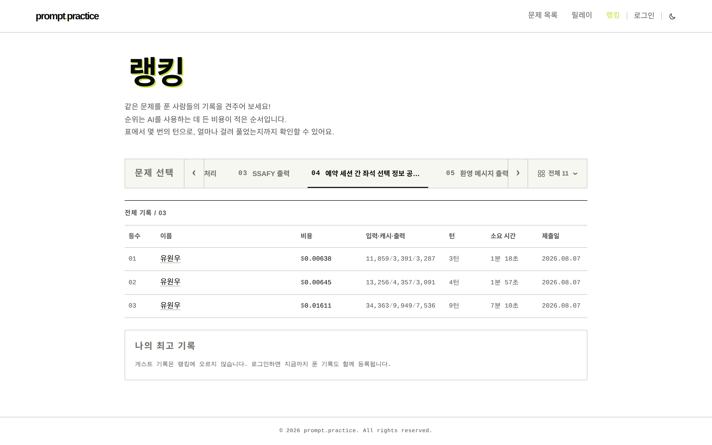

라이트 모드로 찍은 대표 화면은 `screenshots/light-*.png`에 있다.

---

## 4. 화면별

### 4-1. 랜딩 — `/`

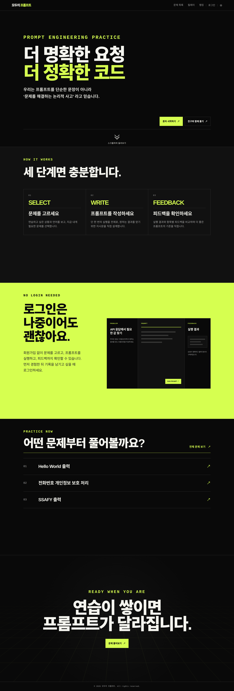

섹션 다섯이 각각 화면 높이(`100svh - 헤더`)를 채우는 풀스크롤이다. 각 섹션은 스크롤로
들어올 때 나타난다(`IntersectionObserver`, 임계값 16%).

| 순서 | 섹션 | 내용 |
| --- | --- | --- |
| 1 | `PROMPT ENGINEERING PRACTICE` | 대형 제목 2줄 + 부제 + 스크롤 유도 |
| 2 | `HOW IT WORKS` | `01 SELECT` · `02 WRITE` · `03 FEEDBACK` 세 칸, 100ms씩 지연 등장 |
| 3 | `NO LOGIN NEEDED` | 배경이 강조색으로 반전. 오른쪽에 작업장을 본뜬 미리보기 |
| 4 | `PRACTICE NOW` | 문제 상위 3개만(`slice(0, 3)`) — 행을 누르면 그 문제로 |
| 5 | `READY WHEN YOU ARE` | 마무리 문구 + `문제 풀어보기 ↗` |

4번만 문제 목록 API를 쓴다. 로딩·오류일 때도 나머지 네 섹션은 그대로 보인다.

### 4-2. 문제 목록 — `/problems`

한 쪽에 10개. 제목 오른쪽의 `JAVA · PYTHON · GAME`은 범례이고, 행 오른쪽 아이콘이 그
문제의 종류를 가리킨다. 종류는 화면이 정하는 것이 아니라 문제 목록 응답의
`type`(`coding` / `game`)과 `language`가 그대로 온 것이다. 게임 문제는 언어가 아니라
문제의 성격으로 묶여 `GAME`이 된다.

목록 위의 `전체 14 · JAVA 05 · PYTHON 05 · GAME 04`는 모아보기 탭이다. 탭 목록은
고정이 아니라 **응답에 실제로 있는 분류만** 세어 만든다 — 결과가 0건인 탭은 아예
생기지 않는다. 순서는 범례와 같게 자바·파이썬을 앞에 두고 나머지는 가나다순이다.

행에 마우스를 올리면 배경이 강조색으로 반전되면서 좌우 여백이 넓어진다.

| 상태 | 표시 |
| --- | --- |
| 로딩 | `문제 목록을 불러오는 중입니다…` |
| 오류 | 서버 메시지 또는 `문제 목록을 불러오지 못했습니다.` |
| 빈 목록 | `등록된 문제가 없습니다.` |

고른 분류와 페이지 번호는 둘 다 주소에 담는다 — `?category=java&page=2`. 페이지 번호가
정수가 아니거나 1 미만이면 1로, 전체 쪽수를 넘으면 마지막 쪽으로 조용히 교정한다
(히스토리에 남기지 않는 `replace`). 목록에 없는 분류가 주소에 남아 있으면 전체로
되돌린다 — 문제가 지워졌거나 주소를 손으로 고친 경우다. 분류를 바꾸면 페이지는 늘
1로 돌아간다. 3쪽을 보던 중에 2쪽뿐인 분류로 옮기면 빈 화면이 뜨기 때문이다.

### 4-3. 작업장 — `/problems/:problemId` · `/attempts/:attemptId`

**이 서비스의 핵심 화면이다.** 주소에 `attemptId`가 있으면 그 풀이를, 없으면 문제
스켈레톤을 연다.

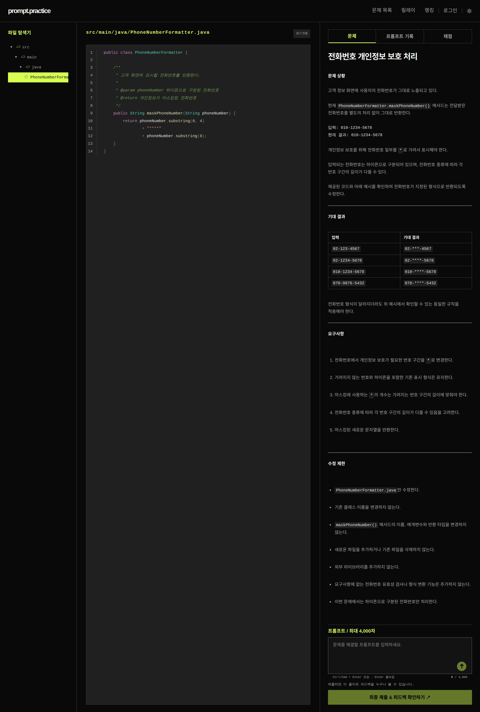

세 칼럼이다.

| 칼럼 | 폭 | 내용 |
| --- | --- | --- |
| 왼쪽 | 230px | 파일 탐색기. 폴더 `▼`/`▶`, 파일 `◇`, 오른쪽에 변경 표시 `A`·`M`·`D` |
| 가운데 | `minmax(360px, 1fr)` | 코드 뷰어. 줄번호가 붙고 편집은 불가능하다 |
| 오른쪽 | `minmax(420px, 480px)` | 위는 탭 3개, 아래는 프롬프트 입력 |

코드를 손으로 고칠 수 없다는 것이 이 서비스의 전제다. 그래서 뷰어에는 `읽기 전용`
배지가 붙어 있다.

**변경 표시와 diff** — 파일 목록의 `A`(추가)·`M`(수정)·`D`(삭제)와 코드 뷰어의 줄
단위 강조는 모두 **직전 턴 대비**다. 마지막 턴이 건드리지 않은 파일에는 강조가 없다.
삭제된 줄은 접힌 채로 `▶ 4줄 삭제됨`처럼 표시되고, 펼치면 원래 줄이 나온다.

**오른쪽 탭 세 개**

| 탭 | 내용 |
| --- | --- |
| 문제 | 문제 명세(`specMd`) 마크다운 |
| 프롬프트 기록 | 턴 목록 — 프롬프트, AI 응답, 토큰·응답 시간, 변경 파일 |
| 채점 | 마지막 채점 결과. 통과 수와 케이스별 통과/실패 |

게임 문제에서는 세 번째 탭이 `채점`이 아니라 `플레이`이고, 브라우저에서 결과물을
직접 돌려 본다(`확대 플레이`로 전체 화면 전환).

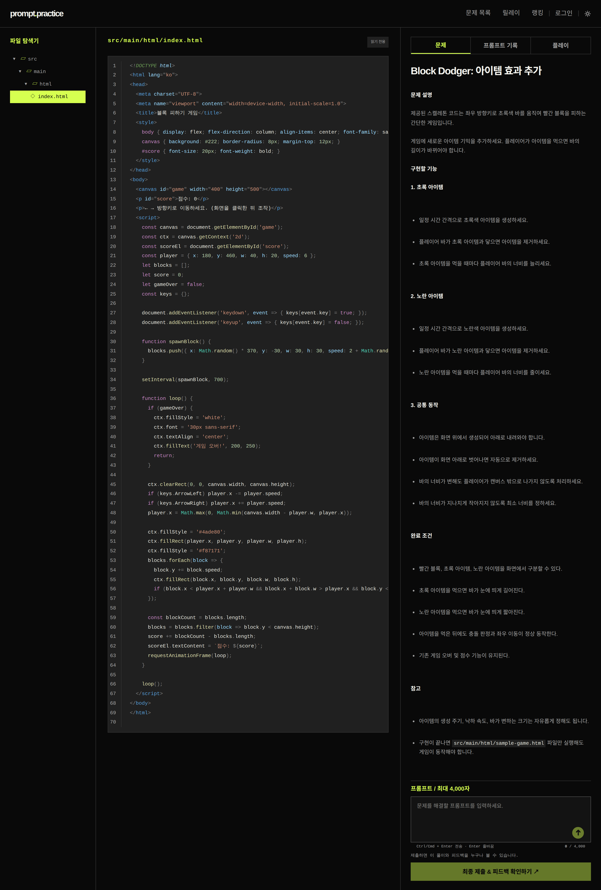

**턴이 있는 풀이를 열면 화면이 「프롬프트 기록」 탭을 스스로 연다.** 방금 실행한
결과를 보여 주는 것이 자연스럽기 때문인데, 남의 제출된 풀이를 열 때도 같은 규칙이
적용된다.

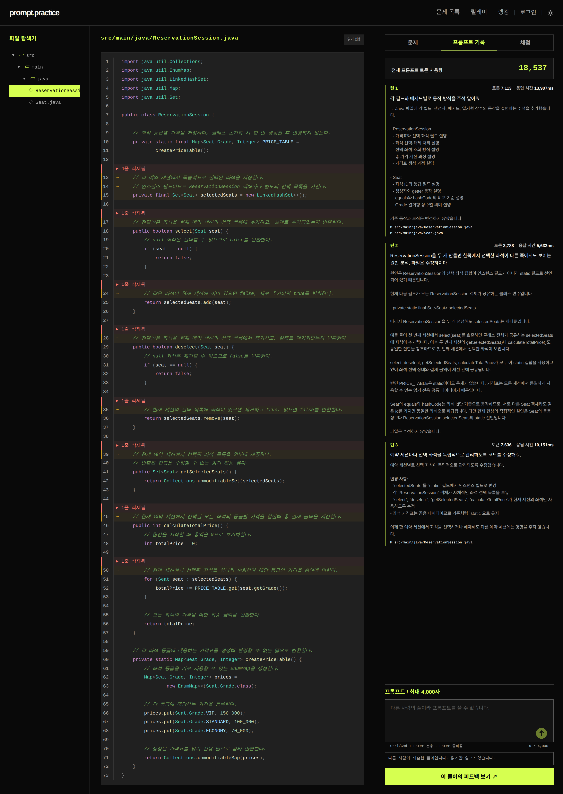

**프롬프트 입력** — 4,000자 제한, `Ctrl/Cmd + Enter` 전송(`Enter`는 줄바꿈, 한글
조합 중에는 전송하지 않는다). 아래에 상태 메시지 줄과 `최종 제출 & 피드백 확인하기 ↗`
버튼이 있다.

| 상황 | 입력창 | 아래 버튼 |
| --- | --- | --- |
| 내 풀이, 진행 중 | 쓸 수 있음 | 최종 제출 |
| 내 풀이, 제출 완료 | 잠김 — `제출이 완료된 어템프트입니다.` | 피드백 보기 |
| 남의 풀이 | 잠김 — `다른 사람의 풀이라 프롬프트를 쓸 수 없습니다.` | `이 풀이의 피드백 보기 ↗` |

**화면 상태**

| 상태 | 표시 |
| --- | --- |
| 첫 로딩 | `문제 상세를 불러오는 중입니다…` (전체 화면) |
| 진입 실패 | 사유 + 돌아갈 버튼 (`어템프트를 찾을 수 없습니다.` 등) |
| 작업 중 실패 | 화면을 덮지 않고 **상태 메시지 줄에만** |
| 실행 중 | `프롬프트를 실행하고 있습니다…` — 입력·실행·제출 모두 잠김 |
| 제출 중 | `프롬프트 피드백을 생성하고 있습니다.` |

전체 화면 로딩은 보여 줄 것이 아직 아무것도 없을 때만 쓴다. 실행 중에 주소가 바뀌어
배경에서 다시 읽을 때 화면을 덮으면, 수 분 걸리는 AI 실행 내내 로딩 문구만 보인다.

**중복 실행 방지** — 같은 프롬프트로 재시도하면 직전과 같은 `Idempotency-Key`가
나가고, 백엔드는 AI를 다시 부르지 않고 이미 만든 결과를 돌려준다. 어템프트 *생성*에는
이 키를 붙이지 않는다. 키는 엔드포인트와 무관하게 조회되므로 생성에 쓴 키가 턴으로
새면 턴이 붙지 않는다.

### 4-4. 프롬프트 피드백 — `/attempts/:attemptId/feedback`

위쪽은 총평 두 개가 나란히다.

| 패널 | 보는 것 |
| --- | --- |
| 프롬프트 총평 | 프롬프트에서 무엇을 전달했고, 무엇이 부족했는지 |
| 작업 패턴 총평 | `이번 세션의 이름`과 `다음 문제에 가져갈 것` 한 줄 |

`다음 문제에 가져갈 것`은 이 세션에서 딱 하나만 뽑아 다음 판으로 넘기는 줄이다.

작업 패턴에 이름을 붙일 때 쓰는 어휘는 지어낸 것이 아니라
[AI Coding Dictionary](https://aicodingdictionary.com)의 *Patterns of Work* 절에서
가져온 것이다(`human review`, `vibe coding`, `grilling` 같은 것들). 그래서 그 이름이
쓰인 문단에는 `용어 출처: AI Coding Dictionary ↗` 링크가 함께 붙는다.

아래는 `턴별 피드백`이고, 턴 수만큼 탭이 생긴다. 탭 하나가 네 칸을 채운다.

| 칸 | 내용 |
| --- | --- |
| 생성된 코드 | 그 턴이 바꾼 파일. 변경이 없으면 `바뀐 파일이 없습니다` |
| 작성한 프롬프트 | 사용자가 낸 원문 그대로 |
| 프롬프트 진단 | 그 프롬프트가 무엇을 시켰고 AI가 어떻게 읽었는지 |
| 작업 패턴 | 앞 턴들과 견준 이번 턴의 성질. 첫 턴은 `첫 턴이라 앞선 결과가 없어요.` |

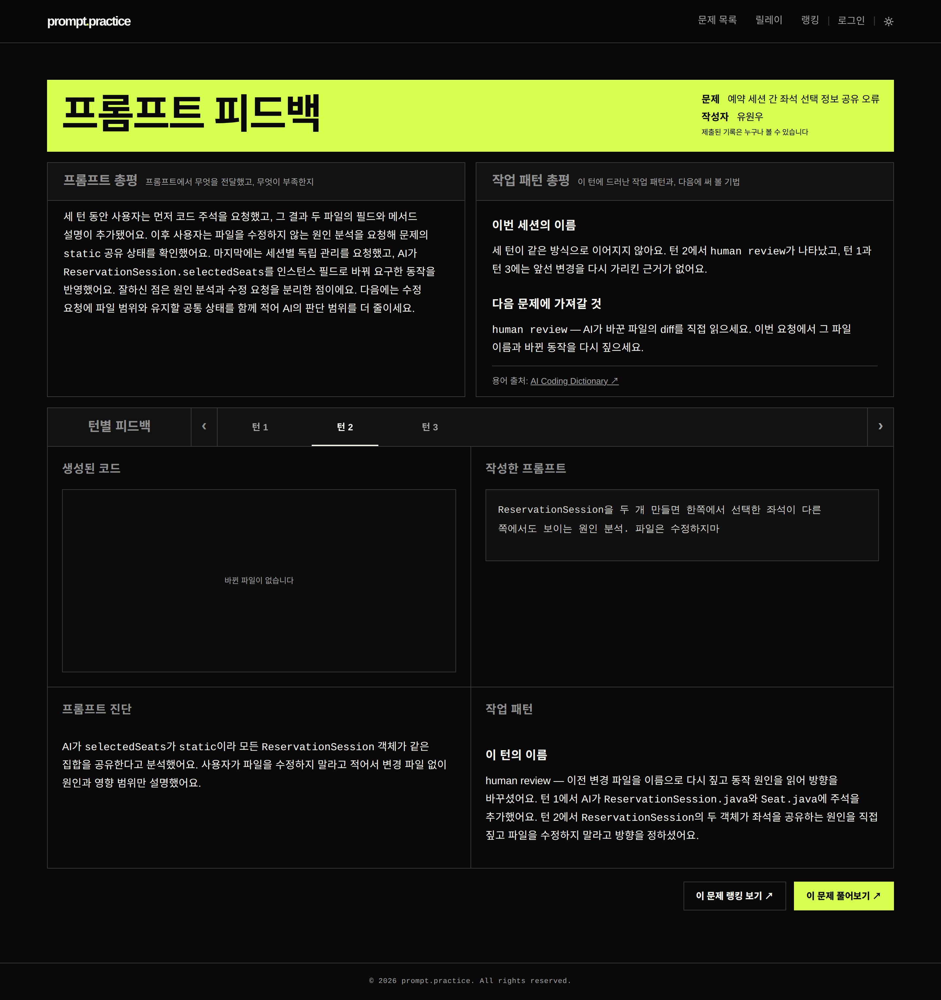

턴 탭의 `›`는 턴이 8개 이상일 때만 눌린다 — 그보다 적으면 탭이 한 줄에 다 들어와
넘길 것이 없다. 아래 버튼 두 개는
`이 문제 랭킹 보기 ↗`와, 내 기록이면 `이전 문제로 돌아가기 ↗` / 남의 기록이면
`이 문제 풀어보기 ↗`로 갈린다.

| 상태 | 표시 | 성격 |
| --- | --- | --- |
| 로딩 | `피드백을 불러오는 중입니다...` | — |
| 잘못된 주소 | `잘못된 어템프트 주소입니다.` | 오류 |
| 아직 미제출 | `아직 제출되지 않은 어템프트입니다.` + 작업장으로 | **오류 아님** |
| 기타 실패 | 서버 메시지 또는 `피드백을 불러오지 못했습니다.` | 오류 |

미제출 어템프트의 피드백 주소를 여는 것은 실수가 아니라 흔한 경로다. 그래서 빨간
오류가 아니라 작업장으로 돌아가라는 회색 안내로 처리한다.

프롬프트 원문은 피드백 응답에 없다. 어템프트를 함께 조회해 턴 번호로 짝지운다.

### 4-5. 랭킹 — `/ranking`

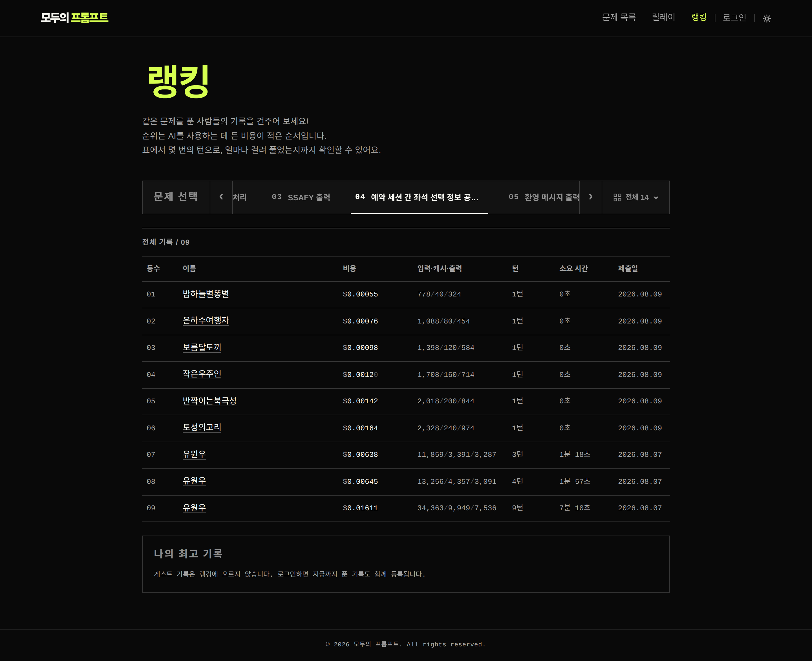

문제 하나를 누가 가장 적은 비용으로 풀었는지 보여 준다. **통과한 제출만** 오르고,
순위는 그 풀이에 든 AI 비용의 오름차순이다.

| 열 | 값 |
| --- | --- |
| 등수 | |
| 이름 | 누르면 그 사람의 피드백 화면으로 (`/attempts/{id}/feedback`) |
| 비용 | 달러, 소수점 5자리까지 |
| 입력·캐시·출력 | 토큰 수 셋 |
| 턴 | 프롬프트를 몇 번 냈는지 |
| 소요 시간 | 첫 AI 호출부터 제출까지. `1분 18초`처럼 큰 단위 두 칸까지 |
| 제출일 | |

어느 문제를 볼지는 경로가 아니라 `?problem=N`에 담는다. 문제 탭이 곧 주소 이동이라
탭을 바꾸면 `page`가 자연히 떨어진다. 탭 화살표만으로는 멀리 있는 문제로 한 번에 못
가므로 오른쪽 끝의 `전체 11`로 목록을 펼친다.

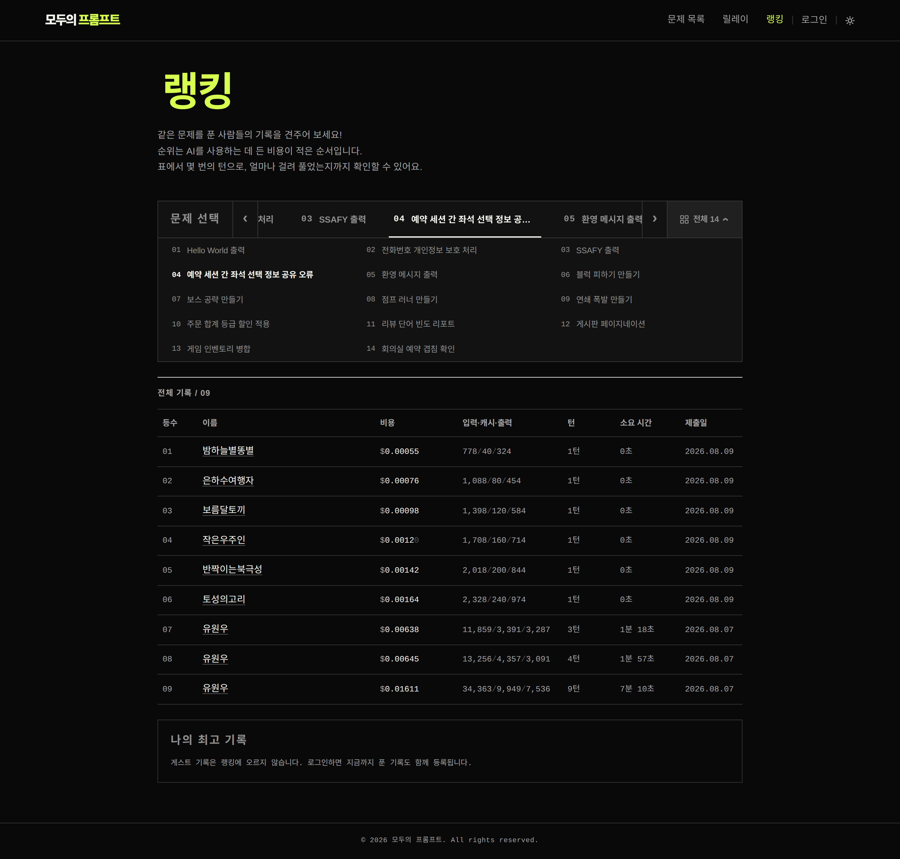

아래 `나의 최고 기록` 밴드는 로그인 상태에서만 채워진다. 비로그인이면
`게스트 기록은 랭킹에 오르지 않습니다. 로그인하면 지금까지 푼 기록도 함께 등록됩니다.`
라고만 적힌다.

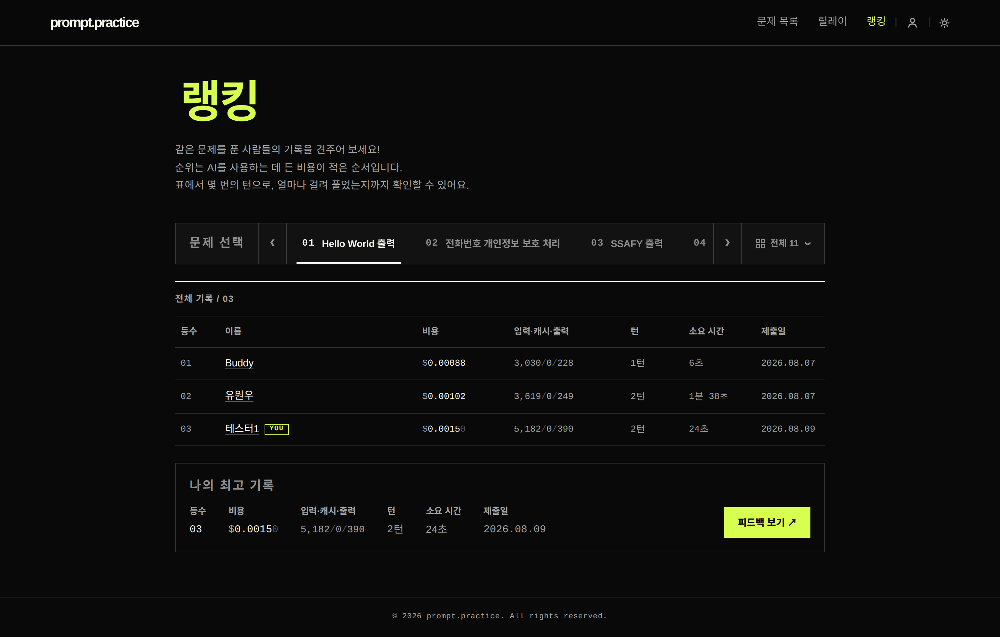

한 쪽에 10개이고, 백엔드가 받는 `limit` 상한이 50이라 51위 이하는 어떤 방법으로도
볼 수 없다.

### 4-6. 릴레이 로비 — `/relay` (로그인 필요)

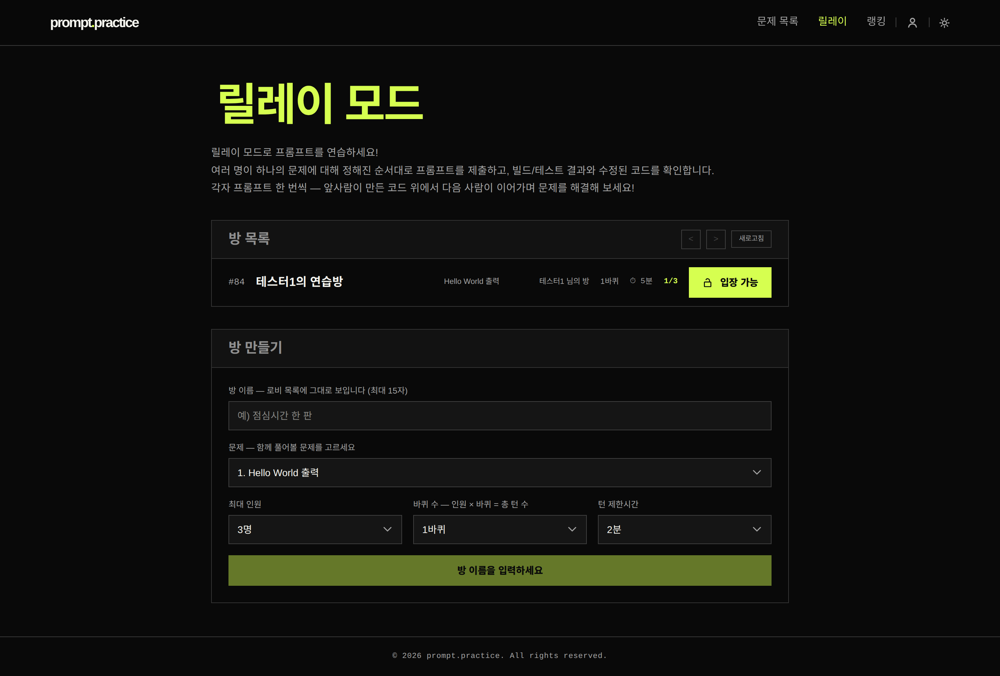

여러 명이 한 문제를 이어 푸는 모드다. 게스트를 받지 않는다 — 좌석의 주인이 세션
만료로 바뀌면 안 되기 때문이다.

위는 **방 목록**(입장을 기다리는 방만, 3개씩). 한 줄에 방 번호·이름·문제·방장·바퀴·
턴 제한시간·인원·입장 버튼이 들어가고, 1024px 아래에서는 방장·바퀴·시간·인원이
숨는다. 목록은 주기적으로 스스로 다시 읽는다. 방 번호는 순번이 아니라 방의 고유
번호여서 닫힌 방이 빠지면 중간이 비어 보인다.

아래는 **방 만들기** 폼이다. 모달이 아니라 늘 펼쳐져 있다.

| 항목 | 선택지 |
| --- | --- |
| 방 이름 | 최대 15자. 비어 있으면 버튼이 `방 이름을 입력하세요`로 잠긴다 |
| 문제 | 문제 목록에서 하나 |
| 바퀴 수 | 1 · 2 · 3 — 인원 × 바퀴 = 총 턴 수 |
| 정원 | 2 ~ 6명 |
| 턴 제한시간 | 30 · 60 · 90 · 120 · 180 · 240 · 300초 |

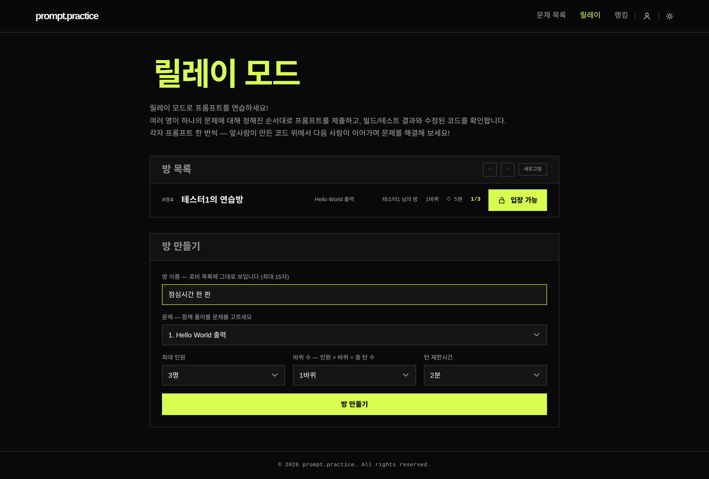

턴 제한시간은 방마다 정하는 값이고 서버가 30~300초로 범위를 막는다. 방장이 고르지
않으면 서버 기본값(`relay.turn-input-timeout`, 2분)이 대신 채워진다 — 그 환경변수는
전역 상한이 아니라 **정하지 않은 방의 기본값**이다.

방 번호를 공유받아 `/relay/rooms/N`으로 곧장 들어가는 것도 된다. 목록은 발견
수단이지 입장의 유일한 관문이 아니다.

정원이 2명부터라 혼자서는 시작할 수 없다. 다만 계정 두 개로 브라우저를 둘 띄우면
혼자서도 한 판을 끝까지 돌려볼 수 있다 — 이 문서의 릴레이 화면들이 그렇게 찍힌 것이다.

### 4-7. 릴레이 방 — `/relay/rooms/:roomId` (로그인 필요)

주소 하나가 상태 여섯 개를 다 맡는다. 화면은 `WAITING`과 그 밖으로 크게 갈린다.

| 상태 | 대기자에게 보이는 문구 |
| --- | --- |
| `WAITING` | 참가자를 기다리는 중 |
| `PLAYING` | 주자가 프롬프트를 준비하는 중 |
| `TURN_GENERATING` | AI가 코드를 생성하는 중… (수십 초) |
| `TURN_GRADING` | 빌드/테스트 채점 중… |
| `FEEDBACK_GENERATING` | 모든 턴 종료 — 피드백을 생성하는 중… |
| `FINISHED` | 게임 종료 |

**대기실 (`WAITING`)**

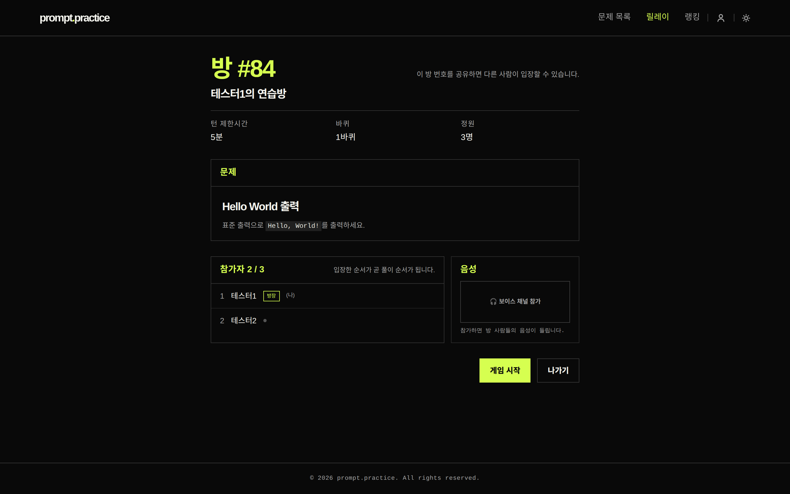

방 설정(턴 제한시간·바퀴·정원)과 문제를 펼쳐 두고, 참가자 목록과 음성 상자를 한 행에
나란히 둔다. 입장한 순서가 곧 풀이 순서이며, 좌석은 게임 시작 시점에 확정된다.
`게임 시작`은 방장에게만 보인다.

**진행 중**

작업장과 비슷한 3분할이지만 왼쪽 칼럼이 다르다. 위에서부터 좌석 목록, 보이스 채널
참가 버튼, 이모지 반응 다섯 개, 파일 탐색기 순이다. 오른쪽 탭은 `문제`와 `실시간` 둘이다.

좌석 한 줄에는 지금 차례인지, 남은 시간, 그리고 **기여도**가 붙는다. 기여도는 그
사람의 턴이 통과시킨 테스트 수의 증감이다 — 앞 사람보다 두 개를 더 통과시켰으면
`+2`이고, 채점을 얻지 못한 턴은 계산에서 빠져 `—`로 남는다.

내 차례가 아니면 프롬프트 입력창 자리에 **현재 주자가 입력 중인 내용이 실시간으로**
비친다. 이 미리보기는 서버를 지나지 않고 P2P로 오간다.

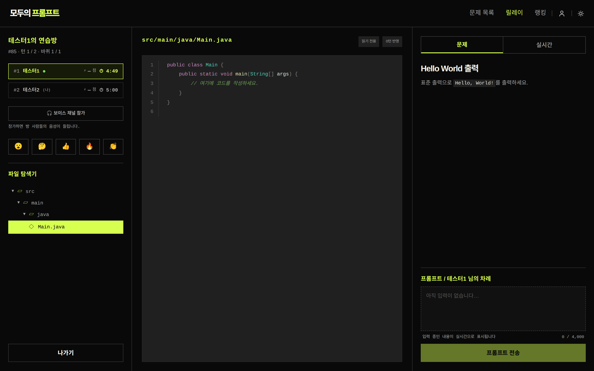

주자가 프롬프트를 내면 모두의 화면이 생성 중 상태로 바뀐다.

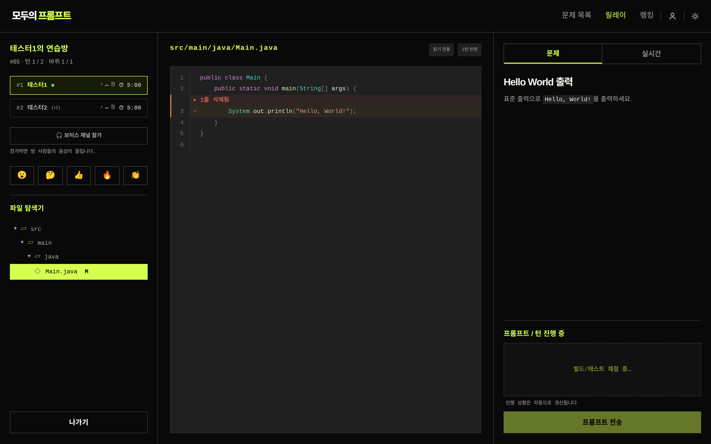

**종료 (`FINISHED`)**

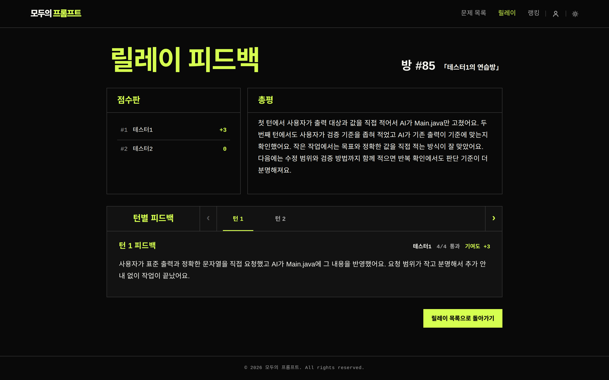

점수판·총평·턴별 피드백으로 바뀐다. 점수판의 숫자는 그 사람의 기여도 합계다.

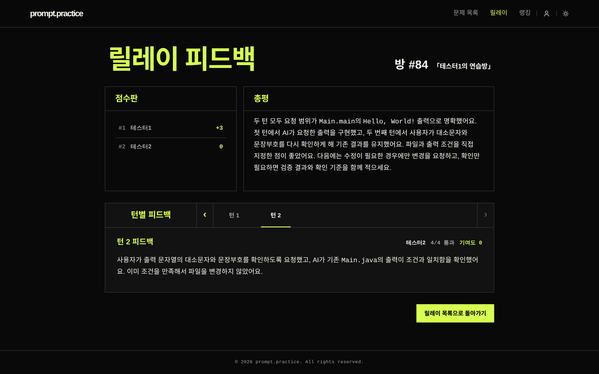

**턴 제한시간을 넘기면 그 턴은 그냥 넘어간다.** 아무도 프롬프트를 내지 않은 채로
모든 턴이 지나가면 점수판이 전부 `—`인 종료 화면이 나온다.

### 4-8. 마이페이지 — `/my` (로그인 필요)

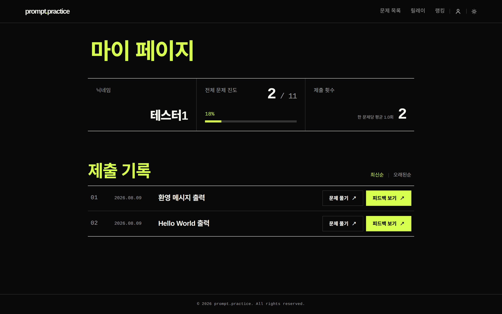

위는 닉네임 · 전체 문제 진도(`푼 문제 / 전체 문제` + 백분율 막대) · 제출 횟수 세 칸이다.
분모는 문제 목록 API에서 읽어 온 실제 문제 수다.
아래는 제출 기록이고, `최신순 | 오래된순`으로 뒤집을 수 있다. 한 쪽에 5개.

정렬은 `?sort=latest|oldest`에 담는다. 알 수 없는 값은 조용히 교정하고, 정렬을 바꾸면
쪽 번호는 1로 돌아간다. 아직 제출한 것이 없으면 `아직 제출한 문제가 없습니다.`와
문제 목록으로 가는 버튼만 남는다.

### 4-9. 로그인 — `/login`

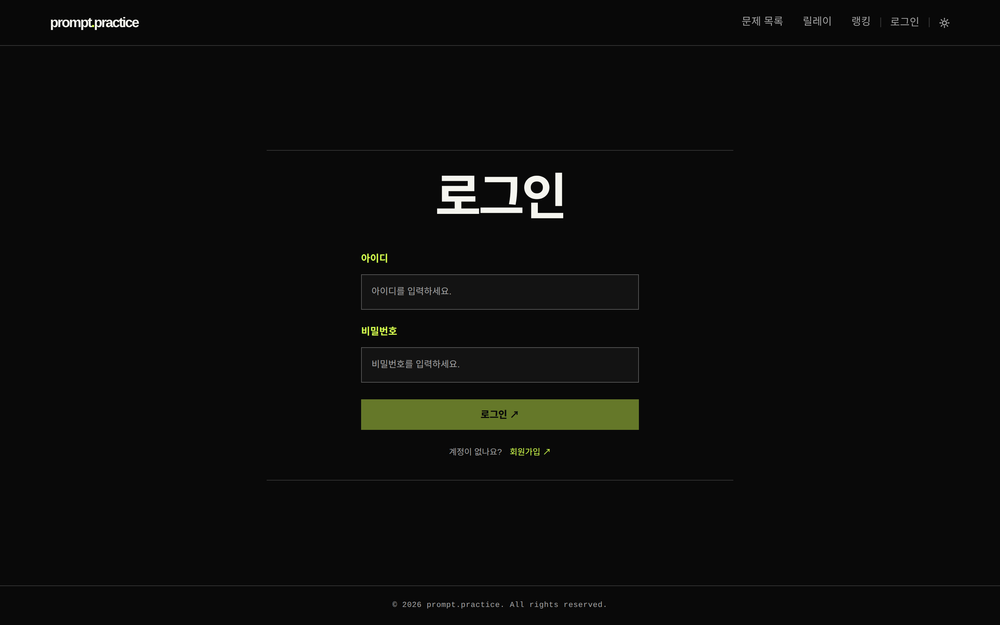

아이디와 비밀번호 두 칸. 성공하면 세션 쿠키가 발급되고 응답 본문이 곧 사용자
정보라, 로그인 직후에 `/api/me`를 또 부르지 않는다.

### 4-10. 회원가입 — `/signup`

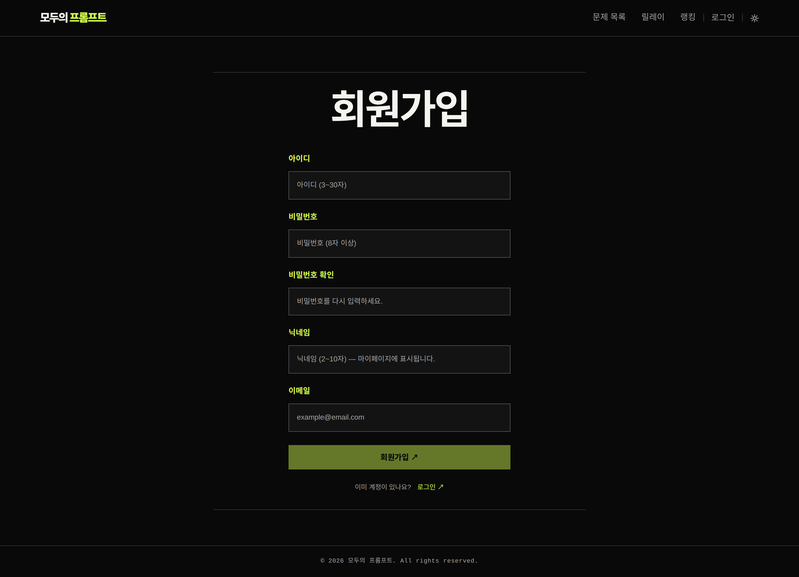

아이디(3~30자) · 비밀번호(8~100자) · 비밀번호 확인 · 닉네임(2~30자) · 이메일.
서버는 가입만으로 세션을 만들지 않으므로, 화면이 이어서 로그인을 자동 호출한 뒤
마이페이지로 보낸다. 사용자에게는 한 번의 동작으로 보인다.

### 4-11. 오류 안내 — `/error`

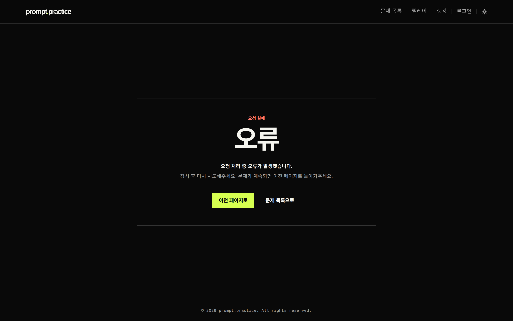

직접 들어오는 화면이 아니다. 다른 화면이 실패를 넘겨줄 때만 의미가 있고, 넘겨받은
값이 없으면 `요청 처리 중 오류가 발생했습니다.`라는 기본 문구로 채워진다. 지금 이
화면으로 보내는 곳은 작업장의 제출 실패 한 곳이다.

---

## 5. 반응형

| 지점 | 화면 | 변화 |
| --- | --- | --- |
| 1200px | 마이페이지 | 위 세 칸이 한 줄에서 풀린다 |
| 1100px | 랜딩 | 섹션 너비 80% → 90% |
| 1080px | 작업장 | 3분할 → 2단 (오른쪽 패널이 아래로 내려가 가로 2단) |
| 1024px | 릴레이 로비 | 방 목록에서 방장·바퀴·시간·인원 열이 숨는다 |
| 900px | 문제 목록·랜딩 | 본문 너비 전환 |
| 760px | 랜딩·피드백·오류·릴레이 | 1열 전환 |
| 700px | 작업장 | 완전 세로 스택, 높이 고정 해제 |
| 640px | 헤더·목록·인증 | 좌우 여백 축소 |
| 480px | 헤더 | 로고와 메뉴가 세로로 쌓임 |

전 화면 최소 너비는 320px이다.

---

## 6. 화면 ↔ API 매핑

기본 경로는 `/api`(환경변수 `VITE_API_BASE_URL`로 교체 가능), 릴레이 소켓은
`/ws/relay/{roomId}`다.

| 화면 | 시점 | 요청 |
| --- | --- | --- |
| 랜딩·문제 목록 | 진입 | `GET /problems` |
| 작업장 (`/problems/:id`) | 진입 | `GET /problems/{id}` |
| 작업장 (`/attempts/:id`) | 진입 | `GET /attempts/{id}` → 응답의 `problemId`로 `GET /problems/{problemId}` |
| 작업장 | 첫 실행 | `POST /attempts` |
| 작업장 | 프롬프트 실행 | `POST /attempts/{id}/turns` (`Idempotency-Key`) → `GET /attempts/{id}` |
| 작업장 | 채점 | `POST /attempts/{id}/runs` · `GET /attempts/{id}/runs` |
| 작업장 | 최종 제출 | `POST /attempts/{id}/submit` |
| 피드백 | 진입 | `GET /attempts/{id}` + `GET /attempts/{id}/feedback` (동시) |
| 랭킹 | 진입·탭 전환 | `GET /problems/{id}/ranking?limit=N` |
| 릴레이 로비 | 진입·주기 갱신 | `GET /relay/rooms` |
| 릴레이 로비 | 방 만들기 | `POST /relay/rooms` |
| 릴레이 방 | 입장 | `POST /relay/rooms/{id}/participants` → 소켓 연결 |
| 릴레이 방 | 시작 | `POST /relay/rooms/{id}/start` |
| 릴레이 방 | 턴 전송 | `POST /relay/rooms/{id}/turns` (AI 생성이 끝날 때까지 응답이 오지 않는다) |
| 릴레이 방 | 코드·턴·피드백 | `GET /relay/rooms/{id}/code` · `/turns` · `/feedback` |
| 릴레이 방 | 나가기 | `DELETE /relay/rooms/{id}/participants/me` |
| 릴레이 방 | 피드백 생성 재시도 | `POST /relay/rooms/{id}/feedback/retry` |
| 릴레이 방 | 음성 | `GET /relay/ice-servers` + WebRTC |
| 마이페이지 | 진입 | `GET /me/attempts` + `GET /problems` (진도 분모용) |
| 로그인·회원가입 | 제출 | `POST /auth/login` · `POST /auth/signup` → 이어서 로그인 |
| 헤더 | 로그아웃 | `POST /auth/logout` |
| 전 화면 | 세션 확인 | `GET /me` |

**요청 취소** — 작업장·피드백·랭킹은 진행 중인 요청을 새 요청이 시작될 때 취소한다.
마지막 응답만 화면에 반영되고, 뒤늦게 끝난 옛 요청이 새 로딩 표시를 끄지 못한다.

**릴레이 방의 정본은 REST다.** 입장 응답 하나로 방 상태가 다 채워지고, 소켓은 그
뒤의 갱신만 나른다. 그래서 소켓이 끊겼다 붙어도 방 상태를 다시 조회하는 것으로
복구된다.

**어템프트 진입에 왕복이 두 번인 이유** — 어템프트 응답에는 문제 제목과 명세가 없다.
다만 명세는 어템프트가 진행돼도 바뀌지 않으므로, 같은 문제를 이미 들고 있으면 다시
읽지 않는다. 두 번의 왕복은 새로고침·북마크 같은 차가운 진입에서만 든다.

---

## 7. 남아 있는 것

- **전용 404 화면이 없다.** 매칭되지 않는 주소에서 react-router의 기본 오류 화면이
  그대로 나온다. 개발자용 안내문이 영어로 노출된다.

  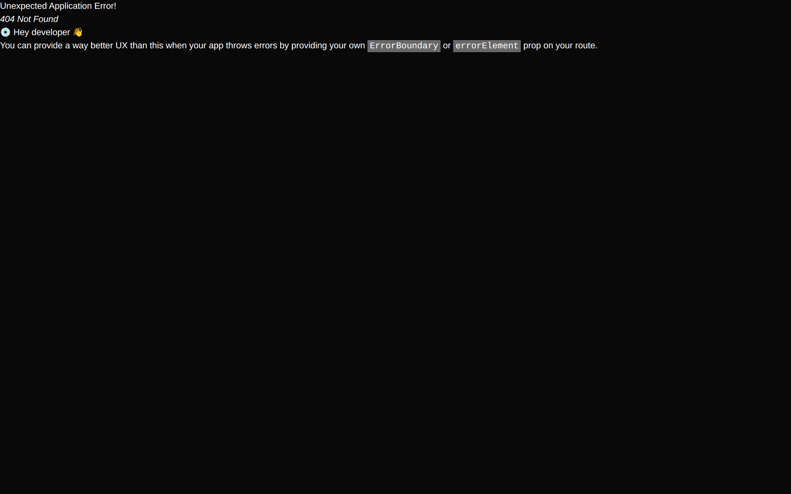

- 빈 껍데기로만 있고 아직 쓰이지 않는 컴포넌트가 셋이다 — `EmptyState`,
  `ErrorState`, `LoadingSpinner`. 각 화면이 로딩·빈 상태·오류를 자체 문구로 처리하고
  있어서다.
- 랭킹은 `offset`이 없어 51위 이하를 볼 수단이 없다.
