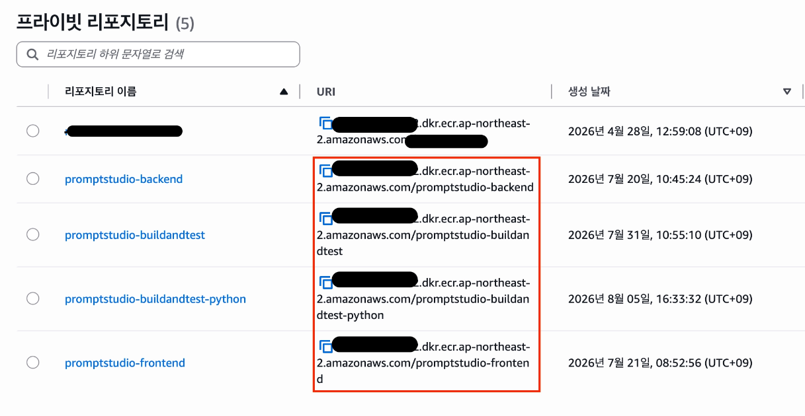

# 외부 서비스

### 1. AWS ECR

- Elastic Container Registry
- AWS에서 제공하는 **완전 관리형 컨테이너 이미지 레지스트리**
- 비공개 Docker Hub 역할
- 애플리케이션을 docker 이미지로 만든 후 저장하기 위한 저장소

#### 1.1. 역할

- **배포 과정에서 만든 docker 이미지를 저장하기 위함**
- 빌드/테스트 → 이미지 생성 →  **ECR에 이미지 업로드 및 저장** → SSH로 배포 서버에 이미지 다운로드 요청 → docker-compose

#### 1.2. IAM 사용자 생성

- ECR를 사용하기 위한 권한만 제한적으로 설정된
- IAM 사용자를 생성해야 함
- IAM → 엑세스 관리 → IAM 사용자 → 사용자 생성


- 직접 정책 연결 → 정책 생성


- 정책 편집기에서 json으로 다음 정책 붙여넣기(ECR 사용 위한 권한)
    
    ```jsx
    {
        "Version": "2012-10-17",
        "Statement": [
            {
                "Sid": "VisualEditor0",
                "Effect": "Allow",
                "Action": [
                    "ecr:CreateRepository",
                    "ecr:BatchGetImage",
                    "ecr:CompleteLayerUpload",
                    "ecr:GetAuthorizationToken",
                    "ecr:DescribeRepositories",
                    "ecr:UploadLayerPart",
                    "ecr:InitiateLayerUpload",
                    "ecr:BatchCheckLayerAvailability",
                    "ecr:PutImage"
                ],
                "Resource": "*"
            }
        ]
    }
    ```
    

#### 1.3. 사용자 보안 자격 증명 생성

- IAM 사용자 → 생성한 사용자 클릭 후
- 보안 자격 증명 → 엑세스 키 → 엑세스 키 만들기
- 다음 두 값을 확인 후 저장
    - **IAM Access Key**
    - **Secret**
- Jenkins에서 이미지 업로드-다운로드를 위한 권한을 갖기 위함

#### 1.4. ECR 레지스트리 확인



- 저장된 이미지 레포지토리의 **주소**를 확인
    - Jenkins 파이프라인 설정에 필요

### 2. OpenAI API

- 프롬프트 결과 코드와 피드백을 받기 위한 AI 에이전트
- 3가지 변수 필요
    - OPENAI_API_KEY=<openai api key>
    - OPENAI_CODE_MODEL=gpt-5.6-luna
    - OPENAI_FEEDBACK_MODEL=gpt-5.6-luna